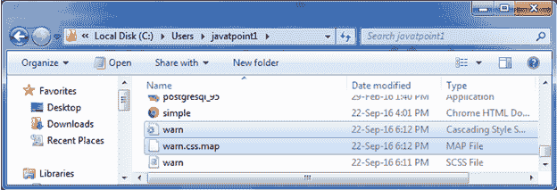
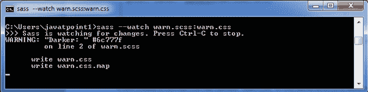

# 萨斯@警告指令

> 原文：<https://www.javatpoint.com/sass-warn-directive>

Sass @warn 指令用于当你遇到问题并想给用户一个警告性的建议时。它向标准错误输出流显示 SassScript 表达式的值。

**@warn 和@debug:** 有两个具体的区别

*   可以使用- quiet 命令行选项或:quiet Sass 选项关闭警告。
*   Sass @warn 指令提供了一个打印输出和消息，以便在出现警告的地方警告用户。

* * *

## Sass @warn 指令示例

让我们创建一个名为“warn.scss”的 SCSS 文件，包含以下数据。

```

$main-color:  #bdc3c7;
@warn "Darker: " darken($main-color, 30%); 

```

现在，打开命令提示符，运行**观察**命令，告诉 SASS 观察文件，并在 SASS 文件发生变化时更新 CSS。

执行以下代码:**sass-watch warn . SCS:warn . CSS**

它会在同一目录下自动创建一个名为“warn.css”的普通 CSS 文件。



**输出:**

