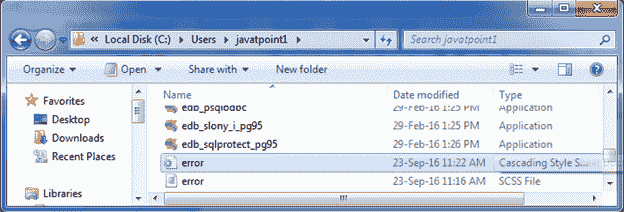
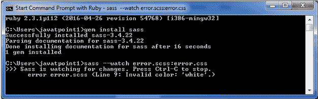

# 错误指令

> 原文:[https://www.javatpoint.com/sass-error-directive](https://www.javatpoint.com/sass-error-directive)

当您想要显示错误时，会使用 Sass @error 指令。它将 SassScript 表达式值显示为致命错误，包括一个很好的堆栈跟踪。

* * *

## 错误指令示例

让我们创建一个名为“error.scss”的 SCSS 文件，包含以下数据。

```
$colors: (
  blue: #c0392b,
  black: #2980b9,
);
@function style-variation($style) {
  @if map-has-key($colors, $style) {
    @return map-get($colors, $style);
  }
  @error "Invalid color: '#{$style}'.";
}
.container {
  style: style-variation(white);
}

```

现在，打开命令提示符，运行**观察**命令，告诉 SASS 观察文件，并在 SASS 文件发生变化时更新 CSS。

执行以下代码:**sass-watch error . scss:error . CSS**

它会在同一个目录下自动创建一个名为“error.css”的普通 CSS 文件。



**输出:**

