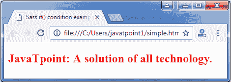
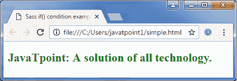

# Sass if()函数

> 原文：<https://www.javatpoint.com/sass-if-function>

Sass 内置 if()函数基于条件。它只从两个可能的结果中返回一个结果。函数的结果取决于结果是真还是假。

**语法:**

```

if( expression, value1, value2 ) 

```

让我们举个例子来看看 if()函数在 SCSS 文件中的用法。我们有一个名为“simple.html”的 HTML 文件，其代码如下:

**HTML 文件:simple.html**

```

   Sass if() condition example

   JavaTpoint:所有技术的解决方案。

```

创建一个名为“simple.scss”的 SCSS 文件，其代码如下:(false 条件)

**档案:simple . SCS**

```

h2{
   color: if( 1 + 1 == 3 , green , red);
}

```

将两个文件都放在根文件夹中。

现在，打开命令提示符，运行**观察**命令，告诉 SASS 观察文件，并在 SASS 文件发生变化时更新 CSS。

执行以下代码:**sass-watch simple . SCS:simple . CSS**

它会在同一个目录下自动创建一个名为“simple.css”的普通 CSS 文件。

**例如:**


创建的 CSS 文件“simple.css”包含以下代码:

```

h2 {
  color: red; }

```

**注意:**这里，创建的 CSS 显示红色，因为 SCSS if 条件为假。

现在，执行上面的 html 文件，它将读取 CSS 值。

**输出:**



**为真实条件创建 SCSS 文件:**

**档案:simple . SCS**

```

h2{
   color: if( 1 + 1 == 2 , green , red);
}

```

它将创建以下 CSS:

```

h2 {
  color: green; }

```

**输出:**

