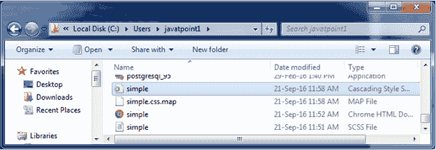
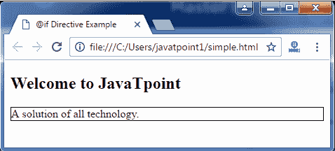

# 如果指令

> 原文：<https://www.javatpoint.com/sass-if-directive>

@if 指令根据表达式的结果指定代码语句的执行。一个@if 语句可以与几个@if else 语句和一个@else 语句一起使用。

@if 指令有两种类型:

*   @if 指令
*   @else if 指令

* * *

# @if 指令

Sass @if 指令接受 SassScript 表达式，如果表达式返回的不是 false 或 null，则使用嵌套样式。

例如:如果使用以下 SCSS 文件。

**SCS 语法:**

```

p {
  @if 1 + 1 == 2 { border: 1px solid;  }
  @if 5 < 3      { border: 2px dotted; }
  @if null       { border: 3px double; }
} 

```

编译后，它将创建一个 CSS 文件，包含以下代码:

**CSS 语法:**

```

p {
  border: 1px solid; } 

```

* * *

# 如果指令示例

让我们举一个例子来演示 Sass @if 指令的用法。我们有一个名为“simple.html”的 HTML 文件，包含以下数据。

**HTML 文件:simple.html**

```

   @if Directive Example

## 欢迎来到 JavaTpoint

所有技术的解决方案。

```

创建一个名为“simple.scss”的 SCSS 文件，包含以下数据。

**SCS 档案:simple . SCS**

```

p {
  @if 1 + 1 == 2 { border: 1px solid;  }
  @if 5 < 3      { border: 2px dotted; }
  @if null       { border: 3px double; }
} 

```

将两个文件都放在根文件夹中。

现在，打开命令提示符，运行**观察**命令，告诉 SASS 观察文件，并在 SASS 文件发生变化时更新 CSS。

执行以下代码:**sass-watch simple . SCS:simple . CSS**

它会在同一个目录下自动创建一个名为“simple.css”的普通 CSS 文件。

**例如:**



创建的 CSS 文件“simple.css”包含以下代码:

```

p {
  border: 1px solid; } 

```

现在，执行上面的 html 文件，它将读取 CSS 值。

输出: