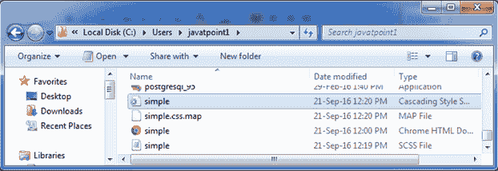
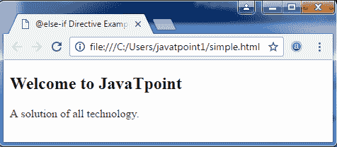

# 萨斯@else-if 指令

> 原文：<https://www.javatpoint.com/sass-else-if-directive>

当@if 指令失败时，使用 Sass @else-if 指令。如果失败，则使用@else 指令。

**SCS 语法:**

```
$type: monster;
p {
  @if $type == ocean {
    color: blue;
  } @else if $type == matador {
    color: red;
  } @else if $type == monster {
    color: green;
  } @else {
    color: black;
  }
}

```

编译后，它将创建一个 CSS 文件，包含以下代码:

**CSS 语法:**

* * *

# Sass @else-if 指令示例

让我们举一个例子来演示 Sass @else-if 指令的用法。我们有一个名为“simple.html”的 HTML 文件，包含以下数据。

**HTML 文件:simple.html**

```

   @if Directive Example

## 欢迎来到 JavaTpoint

所有技术的解决方案。

```

创建一个名为“simple.scss”的 SCSS 文件，包含以下数据。

**SCS 档案:simple . SCS**

```
$type: monster;
p {
  @if $type == ocean {
    color: blue;
  } @else if $type == matador {
    color: red;
  } @else if $type == monster {
    color: green;
  } @else {
    color: black;
  }
}

```

将两个文件都放在根文件夹中。

现在，打开命令提示符，运行**观察**命令，告诉 SASS 观察文件，并在 SASS 文件发生变化时更新 CSS。

执行以下代码:**sass-watch simple . SCS:simple . CSS**

它会在同一个目录下自动创建一个名为“simple.css”的普通 CSS 文件。

**例如:**



创建的 CSS 文件“simple.css”包含以下代码:

```
p {
  color: green; }  

```

现在，执行上面的 html 文件，它将读取 CSS 值。

**输出:**

