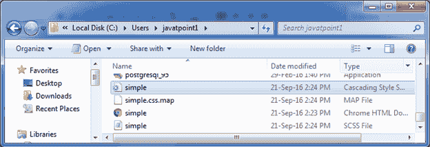
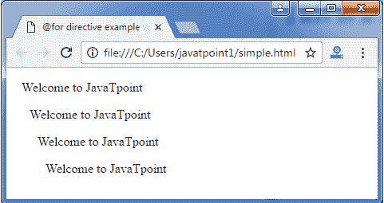

# 指令的 Sass @

> 原文：<https://www.javatpoint.com/sass-for-directive>

Sass @for 指令便于您在循环中生成样式。当您需要重复设置样式时，可以使用它。它使用计数器变量来设置每次迭代的输出。

有两种类型的关键字用于@for 指令:

*   穿过
*   到

* * *

# 通过关键字

在 Sass @for 指令中，through 关键字用于指定包含<start>和<end>值的范围。</end>T3】</start>

**语法:**

```sass

@for $var from through 
```

**参数说明:**

**$var:** 它像$i 一样指定变量的名称。

**<start>和 <end>:</end></start>** <start>和<end>是将返回整数的 SassScript 表达式。如果<start>大于<end>，则减少计数器变量的值，当<start>小于<end>时，则增加计数器变量的值。</end></start></end></start></end></start>

* * *

# 带有直通关键字的指令示例的 Sass @

让我们举一个例子来演示带有 through 关键字的 Sass @for 指令的用法。我们有一个名为“simple.html”的 HTML 文件，包含以下数据。

**HTML 文件:simple.html**

```sass

   @for directive example with through keyword

   欢迎来到 JavaTpoint
   欢迎来到 JavaTpoint
   欢迎来到 JavaTpoint
   欢迎来到 JavaTpoint

```

创建一个名为“simple.scss”的 SCSS 文件，包含以下数据。

**SCS 档案:simple . SCS**

```sass

 @for $i from 1 through 4 {
  .p#{$i} { padding-left : $i * 10px; }
} 

```

将两个文件都放在根文件夹中。

现在，打开命令提示符，运行**观察**命令，告诉 SASS 观察文件，并在 SASS 文件发生变化时更新 CSS。

执行以下代码:**sass-watch simple . SCS:simple . CSS**

它会在同一个目录下自动创建一个名为“simple.css”的普通 CSS 文件。

**例如:**



创建的 CSS 文件“simple.css”包含以下代码:

```sass

.p1 {
  padding-left: 10px; }
.p2 {
  padding-left: 20px; }
.p3 {
  padding-left: 30px; }
.p4 {
  padding-left: 40px; }

```

现在，执行上面的 html 文件，它将读取 CSS 值。

**输出:**



在这里，您可以看到每个下一条语句的 10 px 填充。