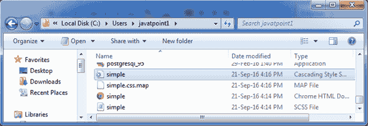
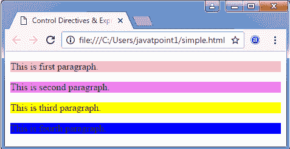

# 每个指令

> 原文:[https://www.javatpoint.com/sass-each-directive](https://www.javatpoint.com/sass-each-directive)

Sass @每个指令包含列表中每个项目的值。它也用于多重赋值和多重赋值映射。

*   简单@每个指令
*   @每个带有多个赋值的指令
*   @带有多个赋值和映射的每个指令

* * *

# 简单@每个指令

在 Sass simple @每个指令中，定义了一个由列表中每个项目的值组成的变量。

**语法:**

```

@each $var in 
```

**参数说明:**

**$var:** 它指定变量的名称。@每个规则为列表中的每个项目设置$var，并使用$var 的值为输出提供样式。

**<list or="" map="">:</list>** <list>和<map>是返回列表或地图的 SassScript 表达式</map></list>

* * *

# 每个指令示例

让我们举一个例子来演示 Sass @每个指令的用法。我们有一个名为“simple.html”的 HTML 文件，包含以下数据。

**HTML 文件:simple.html**

```

   @each Directive Example

   这是第一段。
   这是第二段。
   这是第三段。
   这是第四段。

```

创建一个名为“simple.scss”的 SCSS 文件，包含以下数据。

**SCS 档案:simple . SCS**

```

@each $color in pink, violet, yellow, blue {
  .p_#{$color} {
    background-color: #{$color};
  }
}

```

将两个文件都放在根文件夹中。

现在，打开命令提示符，运行**观察**命令，告诉 SASS 观察文件，并在 SASS 文件发生变化时更新 CSS。

执行以下代码:**sass-watch simple . SCS:simple . CSS**

它会在同一个目录下自动创建一个名为“simple.css”的普通 CSS 文件。

**例如:**



创建的 CSS 文件“simple.css”包含以下代码:

```

.p_pink {
  background-color: pink; }
.p_violet {
  background-color: violet; }
.p_yellow {
  background-color: yellow; }
.p_blue {
  background-color: blue; }

```

现在，执行上面的 html 文件，它将读取 CSS 值。

**输出:**

