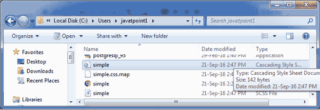
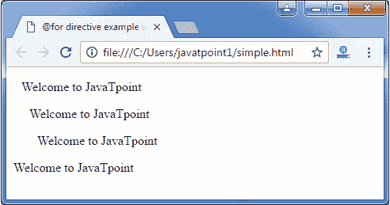

# 带有 To 关键字的指令的 Sass @

> 原文：<https://www.javatpoint.com/sass-to-keyword>

在 Sass @for 指令中，“to”关键字用于指定从<start>值到<end>值之前的值的范围。</end>T3】</start>

**语法:**

```sass
@for $var from to 
```

**参数说明:**

**$var:** 它像$i 一样指定变量的名称。

**<start>和 <end>:</end></start>** <start>和<end>是将返回整数的 SassScript 表达式。如果<start>大于<end>，则减少计数器变量的值，当<start>小于<end>时，则增加计数器变量的值。</end></start></end></start></end></start>

* * *

## 带有 to 关键字的指令示例

让我们举一个例子来演示带有 to 关键字的 Sass @for 指令的用法。我们有一个名为“simple.html”的 HTML 文件，包含以下数据。

**HTML 文件:simple.html**

```sass

   @for directive example with through keyword

   欢迎来到 JavaTpoint
   欢迎来到 JavaTpoint
   欢迎来到 JavaTpoint
   欢迎来到 JavaTpoint

```

创建一个名为“simple.scss”的 SCSS 文件，包含以下数据。

**SCS 档案:simple . SCS**

```sass
@for $i from 1 to 4 {
  .p#{$i} { padding-left : $i * 10px; }
} 

```

将两个文件都放在根文件夹中。

现在，打开命令提示符，运行**观察**命令，告诉 SASS 观察文件，并在 SASS 文件发生变化时更新 CSS。

执行以下代码:**sass-watch simple . SCS:simple . CSS**

它会在同一个目录下自动创建一个名为“simple.css”的普通 CSS 文件。

**例如:**



创建的 CSS 文件“simple.css”包含以下代码:

```sass
.p1 {
  padding-left: 10px; }
.p2 {
  padding-left: 20px; }
.p3 {
  padding-left: 30px; }

```

现在，执行上面的 html 文件，它将读取 CSS 值。

**输出:**



现在，您可以看到填充只对 3 个语句进行，尽管我们对$i 使用了规则@从 1 到 4。

这是@for 指令中的 through 和 to 关键字之间的区别。