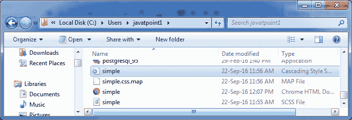
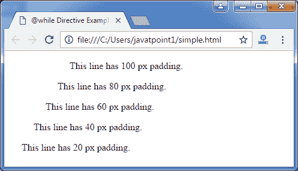

# Sass @while 指令

> 原文：<https://www.javatpoint.com/sass-while-directive>

Sass @while 指令与@for 指令非常相似。它还采用 SassScript 表达式并迭代输出嵌套样式，直到语句返回 false。每次迭代后，计数器的值都会改变(增加/减少)。

**语法:**

```sass

while(condition) {
  // CSS codes
} 

```

* * *

## 指令示例

让我们举一个例子来演示 Sass @while 指令的用法。我们有一个名为“simple.html”的 HTML 文件，包含以下数据。

**HTML 文件:simple.html**

```sass

   @while Directive Example

   这一行有 100 像素的填充。
   这一行有 80 像素的填充。
   这一行有 60 像素的填充。
   这一行有 40 像素的填充。
   这一行有 20 像素的填充。

```

创建一个名为“simple.scss”的 SCSS 文件，包含以下数据。

**SCS 档案:simple . SCS**

```sass

$i: 100;
@while $i > 0 {
  .paddding-#{$i} { padding-left: 1px * $i; }
  $i: $i - 20;
} 

```

将两个文件都放在根文件夹中。

现在，打开命令提示符，运行**观察**命令，告诉 SASS 观察文件，并在 SASS 文件发生变化时更新 CSS。

执行以下代码:**sass-watch simple . SCS:simple . CSS**

它会在同一个目录下自动创建一个名为“simple.css”的普通 CSS 文件。

**例如:**



创建的 CSS 文件“simple.css”包含以下代码:

```sass

.paddding-100 {
  padding-left: 100px; }
.paddding-80 {
  padding-left: 80px; }
.paddding-60 {
  padding-left: 60px; }
.paddding-40 {
  padding-left: 40px; }
.paddding-20 {
  padding-left: 20px; }

```

现在，执行上面的 html 文件，它将读取 CSS 值。

**输出:**

