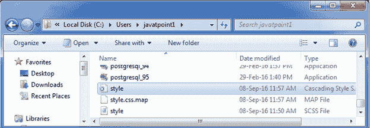
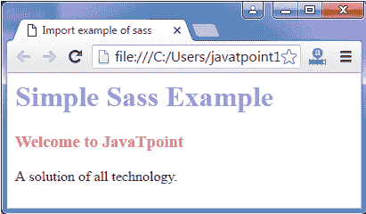

# Sass 预处理

> 原文：<https://www.javatpoint.com/sass-preprocessing>

CSS 足以处理一个简单的样式表，但是如果样式表更大更复杂，它们就更难维护。在这种情况下，预处理器可以提供帮助。Sass 提供了一些 CSS 中没有的扩展特性，如变量、嵌套、混合、继承和其他漂亮的功能，使得它可以兼容处理所有类型的样式表。

当您开始使用 Sass 时，它会将您的预处理 Sass 文件保存为一个简单的 CSS 文件，稍后在您的网页中使用。

安装 sass 后，您可以使用- **监视**标志来监视单个文件或整个目录。查看整个目录时运行 Sass 的语法。

**语法:**

```

sass --watch app/sass:public/stylesheets 

```

创建一个简单的 HTML 文件，包含以下代码:

**见本例:**

```

    Import example of sass

   简单的萨斯例子
   欢迎来到 JavaTpoint
   所有技术的解决方案。

```

创建一个名为“style.scss”的 SCSS 文件，其代码如下:

```

h1{
   color: #AF80ED;
}
h3{
   color: #DE5E85;
}

```

将两个文件都放在根文件夹中。

现在，执行以下代码:-**watch style . SCS:style . CSS**

它会创建一个名为？style.css？自动放在同一个目录下。例如:



现在，执行上面的 html 文件，它将读取 CSS 值。

**输出:**

