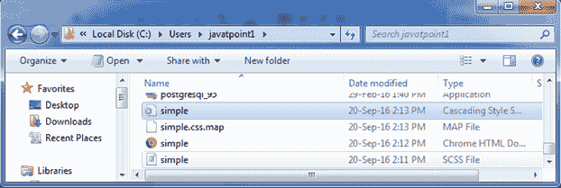
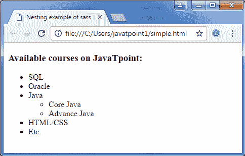

# SASS嵌套

> 原文：<https://www.javatpoint.com/sass-nesting>

通常情况下，HTML 是以清晰的嵌套和可视化的层次结构编写的，而 CSS 不是。Sass 便于您按照与 HTML 相同的视觉层次结构嵌套 CSS 选择器。嵌套时应该非常小心，因为过度嵌套的规则可能会导致复杂性，并且很难维护。

让我们看一个嵌套的例子。

**SCSS 嵌套语法:**

```
nav {
  ul {
    margin: 0;
    padding: 0;
    list-style: none;
  }
  li { display: inline-block; }
  a {
    display: block;
    padding: 6px 12px;
    text-decoration: none;
  }
}

```

**等效 Sass 语法:**

```
nav
  ul
    margin: 0
    padding: 0
    list-style: none
  li
    display: inline-block
  a
    display: block
    padding: 6px 12px
    text-decoration: none

```

当它被处理时，它会像这样为创建一个 CSS。您会看到 ul、li 和 a 选择器嵌套在 nav 选择器中。

**CSS 语法:**

```
nav ul {
  margin: 0;
  padding: 0;
  list-style: none;
}
nav li {
  display: inline-block;
}
nav a {
  display: block;
  padding: 6px 12px;
  text-decoration: none;
} 

```

## 嵌套示例

让我们举个例子来看看嵌套在 Sass 中的使用。我们有一个名为“simple.html”的 HTML 文件，其代码如下:

**文件:simple.html**

```

    Nesting example of sass  

JavaTpoint 上可用的 corses:

  *   结构化查询语言
  *   神谕
  *   爪哇

    *   核心 Java

    *   高级 Java

  *   HTML/CSS
  *   等等。

```

创建一个名为“simple.scss”的 SCSS 文件，其代码如下:

**档案:simple . SCS**

```
nav {  
  ul {  
    margin: 0;  
    padding: 0;  
    list-style: none;  
  }  
  li { display: inline-block; }  
  a {  
    display: block;  
    padding: 6px 12px;  
    text-decoration: none;  
  }  
}  

```

将两个文件都放在根文件夹中。

现在，打开命令提示符，运行**观察**命令，告诉 SASS 观察文件，并在 SASS 文件发生变化时更新 CSS。

执行以下代码:**sass-watch simple . SCS:simple . CSS**

它会在同一个目录下自动创建一个名为“simple.css”的普通 CSS 文件。

**例如:**



创建的 CSS 文件“simple.css”包含以下代码:

```
nav ul {
  margin: 0;
  padding: 0;
  list-style: none; }
nav li {
  display: inline-block; }
nav a {
  display: block;
  padding: 6px 12px;
  text-decoration: none; }

```

现在，执行上面的 html 文件，它将读取 CSS 值。

**输出:**

