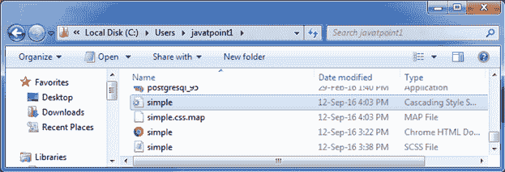

# 萨斯:包括混音

> 原文：<https://www.javatpoint.com/sass-including-a-mixin>

@include 指令用于将 mixin 定义的样式包含到文档中。获取 mixin 的名称，并向其中传递可选参数。>

让我们举一个例子来演示如何在 SCSS 文件中包含 mixin。这里，我们取一个名为“simple.html”的 HTML 文件，它有以下代码。

```

    Mixin example of sass

## 包括混合示例

### 不同的颜色

*   红色

*   格林（姓氏）；绿色的

*   蓝色

```

以 SCSS 文件名“simple.scss”为例，其代码如下:

```

@mixin style {
.cont{
 background-color: #77C1EF;
 color: #ffffff;
    }
h3 {
 color: #ffffff;
 }
}
@include style;

```

打开命令提示符，运行**观察**命令，告诉 SASS 观察文件，每当 SASS 文件发生变化时更新 CSS。

**sass -观察简单。SCS:简单. css**


执行以上命令后，会创建一个名为？simple.css？使用以下代码自动归档。

```

.cont {
  background-color: #77C1EF;
  color: #FF0000; }
h3 {
  color: #FF0000; }

```

可以看到自动创建的 CSS 文件。



**输出:**

应用 CSS 后查看输出。

