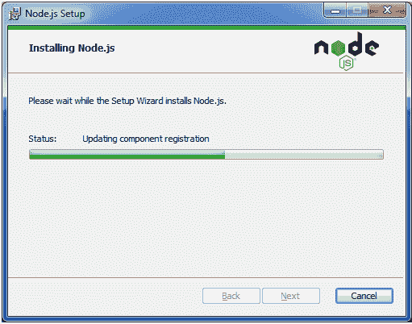

# LESS 安装

> 原文：<https://www.javatpoint.com/less-installation>

* * *

## LESS 安装的最低系统要求

**操作系统:**跨平台

**浏览器支持:** IE (Internet Explorer 8+)，火狐，谷歌 Chrome，Safari。

* * *

## 如何安装

用户需要 Node.js 来运行更少的例子。您必须安装 Node.js 才能运行更少的示例。

要在 windows 上安装 Node.js，请遵循下面给出的说明:

转到链接 https://nodejs.org/en/。你会得到这样一页。

下载具有最新功能的当前版本，并运行可执行文件。

按照指示去做。

接受条款和许可协议。

     

Node.js 安装现已完成。

通过 NPM(节点包管理器)在服务器上少安装**。执行命令**“NPM install-g less”**进入命令提示符。**

 **成功安装 Less 后，您将在命令提示符下看到下面一行。

**