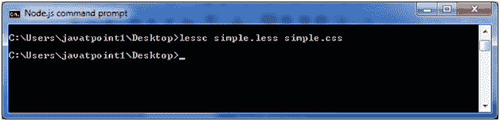
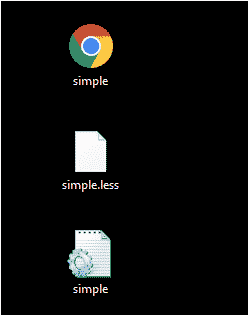
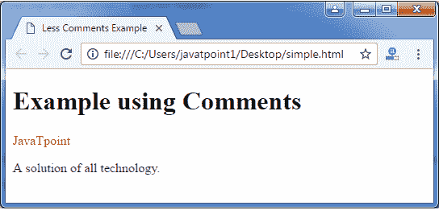

# 较少评论

> 原文:[https://www.javatpoint.com/less-comments](https://www.javatpoint.com/less-comments)

较少的注释是放在源代码中的不可执行语句。编写这些注释是为了使源代码清晰，并且更容易被其他开发人员和测试人员理解。注释可以用块样式编写，并在 Less 代码中内联，但是单行注释不会出现在 CSS 代码中。

Less 支持两种类型的注释。

*   **单行注释:**在 Less 中，单行注释是用//写的，后面是注释。单行注释不会显示在生成的 CSS 输出中。
*   **多行注释:**在 Less 中，多行注释写在/*之间？。*/.多行注释保留在生成的 CSS 输出中。

* * *

## 较少注释示例

让我们举个例子来演示 Less 文件中注释的智慧。

**见本例:**

创建一个名为“simple.html”的 HTML 文件，包含以下数据。

**HTML 文件:simple.html**

```

   Less Comments Example

   使用注释的示例
   JavaTpoint
   所有技术的解决方案。

```

创建一个名为“simple.less”的 LESS 文件，包含以下数据。该文件还包含单行和多行注释。

**LESS 文件:simple.less**

```

/* It displays the
red color! */
.myclass{
color: red;
}
// It displays the green color
.myclass1{
color: green;
} 

```

将文件“simple.html”和“simple.less”放在 Node.js 的根文件夹中

现在，执行以下代码:**lesc simple . less simple . CSS**



这将编译“simple.less”文件。将生成一个名为“simple.css”的 CSS 文件。

**例如:**



生成的 CSS“simple . CSS”，有以下代码:

```

/* It displays the
red color! */
.myclass {
  color: red;
}
.myclass1 {
  color: green;
} 

```

**注意:**在上面的代码中，可以看到生成的 CSS 中只保留了多行注释，单行注释被谢绝。

**输出:**

