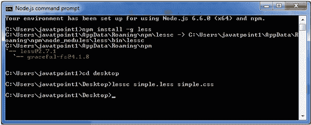
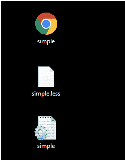
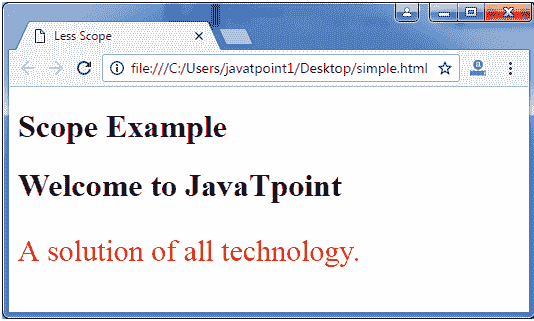

# 可变范围较小

> 原文:[https://www.javatpoint.com/less-variable-scope](https://www.javatpoint.com/less-variable-scope)

在 Less 中，变量范围用于指定可用变量的位置。首先，从局部范围搜索变量，如果变量不可用，编译器将从父范围搜索变量。

让我们举一个例子来演示 Less 文件中名称空间和访问器的使用。

创建一个名为“simple.html”的 HTML 文件，包含以下数据。

**HTML 文件:simple.html**

```

   Less Scope

   范围示例
   欢迎来到 JavaTpoint
   所有技术的解决方案。

```

现在创建一个名为“simple.less”的文件。它类似于 CSS 文件。唯一不同的是，它是用”保存的。少”延伸。

**少文件:简单少**

```

@var: @a;
@a: 25px;
.myclass {
  font-size: @var;
  @a:30px;
  color: red;
} 

```

将文件“simple.html”和“simple.less”放在 Node.js 的根文件夹中

现在，执行以下代码:**lesc simple . less simple . CSS**



这将编译“简单。少”的文件。将生成一个名为“simple.css”的 CSS 文件。

**例如:**



生成的 CSS“simple . CSS”，有以下代码:

```

.myclass {
  font-size: 30px;
  color: red;
}  

```

**输出:**

