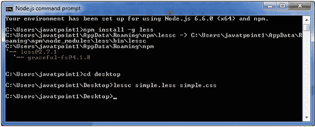
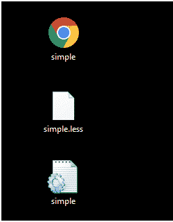
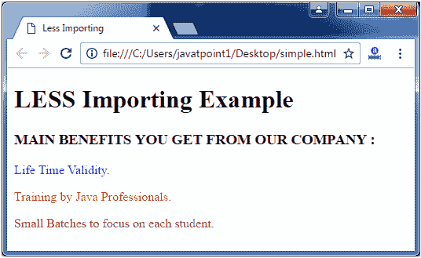

# LESS 导入

> 原文：<https://www.javatpoint.com/less-importing>

在 Less 中，导入用于导入 Less 或 CSS 文件的内容。@import 语句可能会因文件扩展名不同而被 Less 区别对待。

让我们举个例子来演示如何在 Less 文件中使用导入。

创建一个名为“simple.html”的 HTML 文件，包含以下数据。

**HTML 文件:simple.html**

```less

   Less Importing

   较少导入示例
   您从我们公司获得的主要优势:
   生命时间有效性。
   Java 专业人员的培训。
   小批量关注每个学生。

```

接下来，创建一个名为“myfile.less”的要导入的外部文件。

**无文件:myfile.less**

```less

.myclass{
    color: blue;
}
.myclass1{
    color: red;
} 

```

现在创建一个名为“simple.less”的 Less 文件，它有导入路径。

**少文件:简单少**

```less

@import "myfile.less";
.myclass2
{
color: brown;
}

```

myfile.less 文件将从 myfile.less 路径导入 simple.less

现在，将文件“simple.html”和“simple.less”放在 Node.js 的根文件夹中

现在，执行以下代码:**lesc simple . less simple . CSS**



这将编译“simple.less”文件。将生成一个名为“simple.css”的 CSS 文件。

**例如:**



生成的 CSS“simple . CSS”，有以下代码:

```less

.myclass {
  color: blue;
}
.myclass1 {
  color: red;
}
.myclass2 {
  color: brown;
}

```

**输出:**

