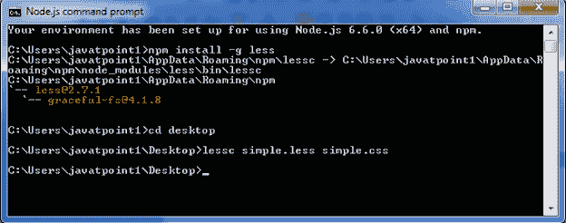
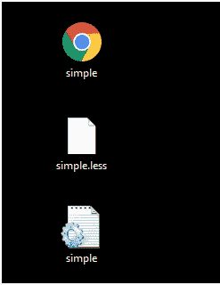
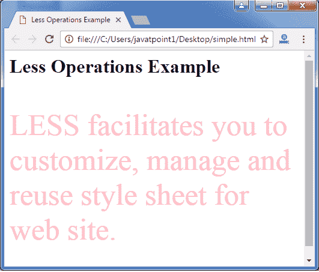

# LESS 操作

> 原文：<https://www.javatpoint.com/less-operations>

Less 支持一些算术运算，如加法(+)、减法(-)、乘法(*)、除法(/)。这些操作可以在任何数字、颜色和变量上完成。在处理变量时节省时间，因为这和处理数学一样简单。

让我们举个例子来演示 Less 操作的用法。

创建一个名为“simple.html”的 HTML 文件，包含以下数据。

**HTML 文件:simple.html**

```less

   Less Operations Example

   较少操作示例
   Less 便于您自定义、管理和重用网站的样式表。

```

现在创建一个名为“simple.less”的文件。它类似于 CSS 文件。唯一不同的是，它是用”保存的。少”延伸。

**少文件:简单少**

```less

@fontSize: 10px;
.myclass {
 font-size: @fontSize * 5;
 color: pink;
}  

```

把两个文件都放进去？simple.html？然后呢。简单。少？在 Node.js 的根文件夹中

现在，执行以下代码:**lesc simple . less simple . CSS**



这将编译“simple.less”文件。将生成一个名为“simple.css”的 CSS 文件。

**例如:**



生成的 CSS“simple . CSS”，有以下代码:

```less

.myclass {
  font-size: 50px;
  color: pink;
} 

```

**输出:**

