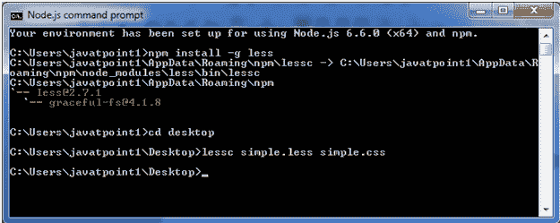
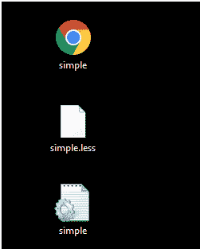
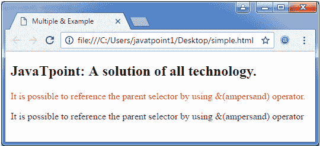

# 多重&父选择器

> 原文：<https://www.javatpoint.com/less-multiple-and-parent-selector>

在 Less 中，&运算符用于重复引用父选择器，而不使用其名称。因此多重&父选择器指定在一个选择器内&运算符可以被多次使用。

* * *

## 多个&示例

让我们举个例子来演示**多个&** 父选择器的用法。

创建一个名为“simple.html”的 HTML 文件，包含以下数据。

HTML 文件:simple.html

```less

    Multiple & Example

JavaTpoint:所有技术的解决方案。
可以使用&运算符引用父选择器。
可以使用&运算符引用父选择器

```

现在创建一个名为“simple.less”的文件。它类似于 CSS 文件。唯一不同的是，它是用”保存的。少”延伸。

**LESS 文件:simple.less**

```less

.select + .select {
  color: pink;
}
.select .select {
  color: blue;
}
.select.select {
  color: red;
}
.select,
.select_class1 {
  color: green;
}

```

将文件“simple.html”和“simple.less”放在 Node.js 的根文件夹中

现在，执行以下代码:**lesc simple . less simple . CSS**



这将编译“simple.less”文件。将生成一个名为“simple.css”的 CSS 文件。

**例如:**



生成的 CSS“simple . CSS”，有以下代码:

```less

.select + .select {
  color: pink;
}
.select .select {
  color: blue;
}
.select.select {
  color: red;
}
.select,
.select_class1 {
  color: green;
}

```

**输出:**

