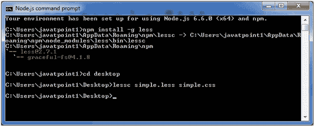
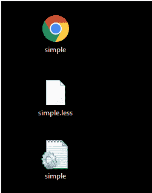

# 组合爆炸父选择器

> 原文:[https://www . javatpoint . com/less-组合-爆炸-父母-选择者](https://www.javatpoint.com/less-combinatorial-explosion-parent-selectors)

&运算符可用于在逗号分隔的列表中产生所有可能的选择器排列。

* * *

## 组合爆炸示例

我们举个例子来演示**组合爆炸**父选择器的用法。

创建一个名为“simple.html”的 HTML 文件，包含以下数据。

**HTML 文件:simple.html**

```

  Combinatorial Explosion Example

这是第一段。
这是与第一段相邻的第二段(即 p + p)。这将被强调。

This div is adjacent to second paragraph ( i.e. p + div ). This will be highlighted.

这是与 div(即 p + div)相邻的第三段。这将被强调。
*This is italic. This will not be highlighted since there is no (p + i) in CSS*
This is second div
This is div adjacent to second div ( i.e. div + div ). This will be highlighted

```

现在创建一个名为“simple.less”的文件。它类似于 CSS 文件。唯一不同的是，它是用”保存的。少”延伸。

**LESS 文件:simple.less**

```

p,
div {
  color: red;
  font-family: Lucida Console;
}
p + p,
p + div,
div + p,
div + div {
  color: brown;
  background-color: aqua;
  font-family: "Comic Sans MS";
}

```

将文件“simple.html”和“simple.less”放在 Node.js 的根文件夹中

现在，执行以下代码:**lesc simple . less simple . CSS**



这将编译“simple.less”文件。将生成一个名为“simple.css”的 CSS 文件。

**例如:**



生成的 CSS“simple . CSS”，有以下代码:

```

p,
div {
  color: red;
  font-family: Lucida Console;
}
p + p,
p + div,
div + p,
div + div {
  color: brown;
  background-color: aqua;
  font-family: "Comic Sans MS";
}

```

**输出:**

