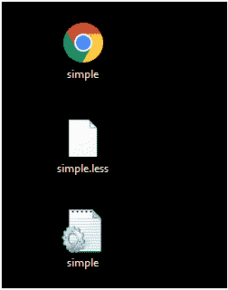

# LESS 功能

> 原文：<https://www.javatpoint.com/less-functions>

很多功能，如圆形功能，地板功能，天花板功能，百分比功能等。在 Less 中被支持来操纵样式表中的颜色和 HTML 元素方面。Less 将 JavaScript 代码与值的操作进行映射，并使用预定义的函数。

让我们举个例子来演示 Less 函数的用法:

创建一个名为“simple.html”的 HTML 文件，包含以下数据。

**HTML 文件:simple.html**

```

   Less Functions Example

   较少函数示例
   Less 便于您自定义、管理和重用网站的样式表。

```

现在创建一个名为“simple.less”的文件。它类似于 CSS 文件。唯一不同的是，它是用”保存的。少”延伸。

**少文件:简单少**

```

@color: #FF8000;
@width:1.0;
.mycolor{
color: @color;
 width: percentage(@width);
} 

```

将文件“simple.html”和“simple.less”放在 Node.js 的根文件夹中

现在，执行以下代码:**lesc simple . less simple . CSS**


这将编译“simple.less”文件。将生成一个名为“simple.css”的 CSS 文件。

**例如:**



生成的 CSS“simple . CSS”，有以下代码:

```

.mycolor {
  color: #FF8000;
  width: 100%;
}

```

**输出:**

