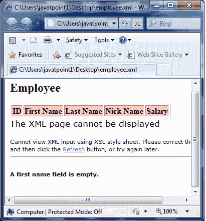
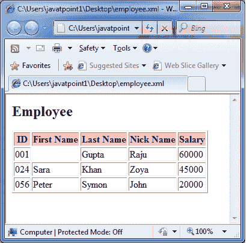

# XSLT <message>元素</message>

> 原文：<https://www.javatpoint.com/xslt-xsl-message-element>

XSLT <message>元素用于显示错误消息，并帮助调试 XSLT 处理。它类似于 JavaScript 警报。这个元素将一个消息缓冲到 XSLT 处理器，XSLT 处理器终止处理并向调用者应用程序发送一个消息来显示一个错误消息。</message>

```
<xsl:message 
   terminate = "yes" | "no">
</xsl:message> 

```

* * *

## 参数说明

**终止:**它指定转换是否应该在执行该指令时终止。当终止属性设置为“是”时，元素的内容显示为系统级错误消息的一部分，转换终止。当设置为“否”时，转换继续，忽略错误消息。缺省值是？没有吗？。

* * *

## XSLT <message>元素示例</message>

## 对于“是”条件

让我们举一个例子，通过迭代每个员工来创建一个属性为“id”的<student>元素及其子元素<firstname>、<lastname>、<nickname>和<salary>。它检查作为名字的键是否存在，然后打印员工的详细信息，否则显示一条错误消息。</salary></nickname></lastname></firstname></student>

**Employee.xml**

```
<?xml version = "1.0"?>
<?xml-stylesheet type = "text/xsl" href = "employee.xsl"?> 
<class> 
   <employee id = "001">
      <firstname></firstname> 
      <lastname>Gupta</lastname> 
      <nickname>Raju</nickname> 
      <salary>30000</salary>
   </employee> 
   <employee id = "024"> 
      <firstname>Sara</firstname> 
      <lastname>Khan</lastname> 
      <nickname>Zoya</nickname> 
      <salary>25000</salary>
   </employee> 
   <employee id = "056"> 
      <firstname>Peter</firstname> 
      <lastname>Symon</lastname> 
      <nickname>John</nickname> 
      <salary>10000</salary> 
   </employee> 
</class>

```

**员工 xsl**

```
<?xml version = "1.0" encoding = "UTF-8"?> 
<xsl:stylesheet version = "1.0" 
   xmlns:xsl = "http://www.w3.org/1999/XSL/Transform">   
   <xsl:template match = "/"> 
      <html> 
         <body> 
            <h2>Employee</h2> 
            <table border = "1"> 
               <tr bgcolor = "pink"> 
                  <th>ID</th> 
                  <th>First Name</th> 
                  <th>Last Name</th> 
                  <th>Nick Name</th> 
                  <th>Salary</th> 
               </tr> 

               <xsl:for-each select = "class/employee"> 

                  <xsl:if test = "firstname = ''"> 
                     <xsl:message terminate = "yes">A first name field is empty. 
                     </xsl:message> 
                  </xsl:if> 

                  <tr> 
                     <td><xsl:value-of select = "@id"/></td> 
                     <td><xsl:value-of select = "firstname"/></td> 
                     <td><xsl:value-of select = "lastname"/></td>
                     <td><xsl:value-of select = "nickname"/></td> 
                     <td><xsl:value-of select = "salary"/></td> 
                  </tr> 
               </xsl:for-each> 
            </table> 
         </body> 
      </html> 
   </xsl:template>
</xsl:stylesheet>

```

**输出:**



## 对于“否”条件

**员工 xsl**

```
<?xml version = "1.0" encoding = "UTF-8"?> 
<xsl:stylesheet version = "1.0" 
   xmlns:xsl = "http://www.w3.org/1999/XSL/Transform">   
   <xsl:template match = "/"> 
      <html> 
         <body> 
            <h2>Employee</h2> 
            <table border = "1"> 
               <tr bgcolor = "pink"> 
                  <th>ID</th> 
                  <th>First Name</th> 
                  <th>Last Name</th> 
                  <th>Nick Name</th> 
                  <th>Salary</th> 
               </tr> 

               <xsl:for-each select = "class/employee"> 

                  <xsl:if test = "firstname = ''"> 
                     <xsl:message terminate = "no">A first name field is empty. 
                     </xsl:message> 
                  </xsl:if> 

                  <tr> 
                     <td><xsl:value-of select = "@id"/></td> 
                     <td><xsl:value-of select = "firstname"/></td> 
                     <td><xsl:value-of select = "lastname"/></td>
                     <td><xsl:value-of select = "nickname"/></td> 
                     <td><xsl:value-of select = "salary"/></td> 
                  </tr> 
               </xsl:for-each> 
            </table> 
         </body> 
      </html> 
   </xsl:template>
</xsl:stylesheet>

```

**输出:**

