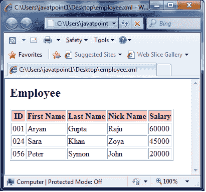

# XSLT <import>元素</import>

> 原文：<https://www.javatpoint.com/xslt-xsl-import-element>

XSLT <import>元素用于将一个样式表的内容导入到另一个样式表中。导入样式表的优先级高于导入样式表。</import>

```
<xsl:import href = "uri"> 
</xsl:import>

```

* * *

## 参数说明

**href:** 用于提供要导入的 xslt 样式表的路径。

* * *

## XSLT <import>元素示例</import>

让我们举一个例子来创建一个<employee>元素的列表，它的属性为“id”，其子元素为<firstname>、<lastname>、<nickname>和<salary>，遍历每个员工。在本例中，我们创建了两个 xsl 样式表，其中 employee_import.xsl 样式表导入 employee.xsl，employee.xml 链接到 employee_import.xsl。</salary></nickname></lastname></firstname></employee>

**Employee.xml**

```
<?xml version = "1.0"?>
<?xml-stylesheet type = "text/xsl" href = "employee_import.xsl"?> 
<class> 
   <employee id = "001">
      <firstname>Aryan</firstname> 
      <lastname>Gupta</lastname> 
      <nickname>Raju</nickname> 
      <salary>30000</salary>
   </employee> 
   <employee id = "024"> 
      <firstname>Sara</firstname> 
      <lastname>Khan</lastname> 
      <nickname>Zoya</nickname> 
      <salary>25000</salary>
   </employee> 
   <employee id = "056"> 
      <firstname>Peter</firstname> 
      <lastname>Symon</lastname> 
      <nickname>John</nickname> 
      <salary>10000</salary> 
   </employee> 
</class>

```

**员工 xsl**

```
<?xml version = "1.0" encoding = "UTF-8"?> 
<xsl:stylesheet version = "1.0" 
   xmlns:xsl = "http://www.w3.org/1999/XSL/Transform">    
   <xsl:template match = "/"> 
      <html> 
         <body>
            <h2>Employee</h2> 
            <table border = "1"> 
               <tr bgcolor = "pink"> 
                  <th>ID</th> 
                  <th>First Name</th> 
                  <th>Last Name</th> 
                  <th>Nick Name</th> 
                  <th>Salary</th> 
               </tr>

               <xsl:for-each select = "class/employee"> 

                  <tr> 
                     <td><xsl:value-of select = "@id"/></td> 
                     <td><xsl:value-of select = "firstname"/></td> 
                     <td><xsl:value-of select = "lastname"/></td> 
                     <td><xsl:value-of select = "nickname"/></td> 
                     <td><xsl:value-of select = "salary"/></td> 
                  </tr> 
               </xsl:for-each> 
            </table> 
         </body> 
      </html> 
   </xsl:template>  
</xsl:stylesheet>

```

**Employee_import.xsl:**

```
<?xml version = "1.0" encoding = "UTF-8"?> 
<xsl:stylesheet version = "1.0" 
   xmlns:xsl = "http://www.w3.org/1999/XSL/Transform">  
   <xsl:import href = "employee.xsl"/>  
   <xsl:template match = "/"> 
      <xsl:apply-imports/> 
   </xsl:template>  
</xsl:stylesheet>

```

**输出:**

