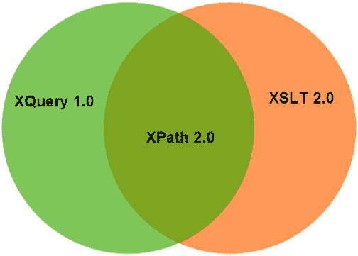

# XPath 教程

> 原文：<https://www.javatpoint.com/xpath-tutorial>

XPath 教程提供了 XPath 的基本和高级概念。我们的 XPath 教程是为初学者和专业人士设计的。

XPath 是 W3C 提供的 XSLT 标准的一个组件。它用于遍历 XML 文档的元素和属性。

我们的 XPath 教程包括 XPath 的所有主题，如 XPath 语法、表达式、节点、运算符、轴、绝对路径、相对路径、通配符等。

* * *

## XPath 索引

* * *

**XPath 教程**

*   [XPath 教程](xpath-tutorial)
*   [什么是 XPath](what-is-xpath)
*   [XPath 表达式](xpath-expression)
*   [XPath 节点](xpath-nodes)
*   [XPath 语法](xpath-syntax)
*   [XPath 绝对路径](xpath-absolute-path)
*   [XPath 相对路径](xpath-relative-path)
*   [XPath 轴](xpath-axes)

*   [XPath 运算符](xpath-operators)
*   [1) XPath 比较](xpath-comparison-operators)
*   [2) XPath 布尔](xpath-boolean-operators)
*   [3) XPath 编号](xpath-number-operators-functions)
*   [4) XPath 字符串](xpath-string-functions)
*   [5) XPath 节点](xpath-node-functions)
*   [XPath 通配符](xpath-wildcard)
*   [XPath 谓词](xpath-predicate)

**面试问题**

*   [XPath 面试](xpath-interview-questions)

* * *

## 先决条件

在学习 XPath 之前，您必须具备 XML 的基本知识。

## 观众

我们的 XPath 教程旨在帮助初学者和专业人士。

## 问题

我们保证您在这个 XPath 教程中不会发现任何问题。但是如果有任何错误，请在联系表格中发布问题。