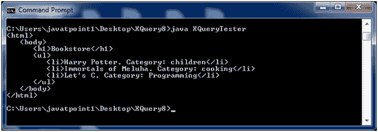

# XQuery 添加

> 原文:[https://www.javatpoint.com/xquery-add](https://www.javatpoint.com/xquery-add)

XQuery Add 用于在输入文档的结果中添加元素、属性、HTML 元素和文本。

让我们用一个例子来理解它。

## XQuery 添加示例

以一个名为 books.xml 的 XML 文件为例，它包含以下数据。

**books.xml**

```
 <book category="Mythology"><title lang="en">Immortals of Meluha</title>
<author>Amish</author>
<year>2010</year>
<price>180</price></book> 
 <book category="Children"><title lang="en">Harry Potter</title>
<author>J K. Rowling</author>
<year>2005</year>
<price>300</price></book> 
 <book category="Programming"><title lang="en">Let's C</title>
<author>Yashwant Kanetkar</author>
<year>2003</year>
<price>200</price></book> 

```

## XQuery 表达式

**图书. xqy**

```

for $x in doc("books.xml")/bookstore/book/title
order by $x
return $x

```

现在，这个 XQuery 表达式将以与输入文档中描述的相同方式返回标题元素。

**输出:**


现在，您可以将自己的元素和属性添加到结果中。

## 添加 HTML 元素和文本

如果您想向结果中添加一些 HTML 元素，请使用如下 XQuery:

**本书. xqy:**

```

书店

{
for $x in doc("books.xml")/bookstore/book
order by $x/title
return *   {数据($x/title)}。类别:{数据($ x/@类别)}
}

```

[download this example](https://static.javatpoint.com/xquery/src/XQuery8.zip)