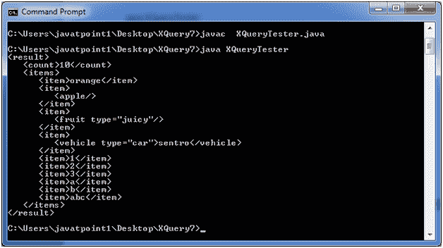

# XQuery 序列

> 原文：<https://www.javatpoint.com/xquery-sequences>

XQuery 序列用于指定有序的项目集合。这些项目可以是相似或不同的类型。

* * *

## 创建序列

XQuery 序列是使用括号创建的，括号中的字符串包含引号、双引号或数字。XML 元素也可以用作序列的项目。

有两种方法可以创建一个接一个迭代的序列项。

*   使用索引
*   使用值

* * *

## 索引的 XQuery 表达式

**项. xqy**

```

let $items := ('orange', <apple/>, <fruit type="juicy"/>, <vehicle type="car">sentro</vehicle>, 1,2,3,'a','b',"abc")
let $count := count($items)
return
<result>
   <count>{$count}</count>   
   <items>
      {
	     for $item in $items
         return <item>{$item}</item>
      }
   </items>   
</result>

```

## 怎么跑

创建一个基于 Java 的 XQuery executor 程序来读取 items.xqy，将其传递给 XQuery 表达式处理器，并执行该表达式。之后将显示结果。

**XQueryTester.java**

```

import java.io.File;
import java.io.FileInputStream;
import java.io.FileNotFoundException;
import java.io.InputStream;
import javax.xml.xquery.XQConnection;
import javax.xml.xquery.XQDataSource;
import javax.xml.xquery.XQException;
import javax.xml.xquery.XQPreparedExpression;
import javax.xml.xquery.XQResultSequence;
import com.saxonica.xqj.SaxonXQDataSource;
public class XQueryTester {
   public static void main(String[] args){
      try {
         execute();
      }
      catch (FileNotFoundException e) {
         e.printStackTrace();
      }      
      catch (XQException e) {
         e.printStackTrace();
      }
   }
   private static void execute() throws FileNotFoundException, XQException{
      InputStream inputStream = new FileInputStream(new File("items.xqy"));
      XQDataSource ds = new SaxonXQDataSource();
      XQConnection conn = ds.getConnection();
      XQPreparedExpression exp = conn.prepareExpression(inputStream);
      XQResultSequence result = exp.executeQuery();
       while (result.next()) {
         System.out.println(result.getItemAsString(null));
      }
   }	
}

```

* * *

## 对 XML 执行 XQuery

将以上三个文件放在同一个位置。我们将它们放在桌面上一个名为 XQuery7 的文件夹中。使用控制台编译 XQueryTester.java。您的计算机上必须安装 JDK 1.5 或更高版本，并且配置了类路径。

**编译:**

javac XQueryTester.java

**执行:**

java XQueryTester

**输出:**



* * *

## 索引的 XQuery 表达式

**项. xqy**

```

let $items := (1,2,3,4,5,6)
let $count := count($items)
return
   <result>
      <count>{$count}</count>  
      <items>
      {
         for $item in $items
         return <item>{$item}</item>
      }
      </items>   
   </result>

```

遵循与上述相同的程序:

**输出:**

[download this example](https://static.javatpoint.com/xquery/src/XQuery7.zip)