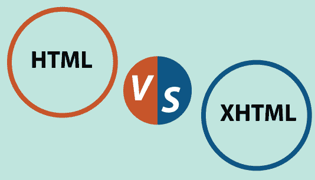

# HTML 和 XHTML 的区别

> 原文：<https://www.javatpoint.com/html-vs-xhtml>

在本文中，您将了解 **HTML** 和 **XHTML** 之间的区别，但是在讨论这些区别之前，您必须先简单了解一下。

## 什么是 XHTML？

XHTML 代表可扩展 HTML，它是 HTML(HTML)和 XML(可扩展标记语言)之间的连接，在大多数地方，XHTML 被认为比 HTML 优越。

XHTML 很容易与其他数据格式一起使用，而且它比 HTML 更严格，因此可以创建更整洁的代码。因此，它与大多数浏览器更兼容，并且它维护了可用于各种设备的代码标准。

### 例子

下面是 XHTML 的一个例子，

```

<!DOCTYPE html PUBLIC "-// W //DT XHTML 1.2 //EN"
" http : // www . myblogpost .org/T /xhtml12 / DT / xhtml12.dtd">
<html xmlns=http://www. myblogpost . org / 199 / xhtml >
<head>
<title> XHTML document </title>
</head>
<body>

Wrong XHTML rule<br>
Correct XHTML rule<br />

Wrong XHTML rule <hr>
Correct XHTML rule <hr />

Wrong XHTML rule 
Correct XHTML rule 

</body>
</html>

```

**输出**

上面的代码给出了以下输出。

```
Correct XHTML rule 

Correct XHTML rule

Correct XHTML rule

```

### XHTML 的优势

以下是 XHTML 的优点，例如:

*   在使用 XHTML 的同时，网络应用程序的代码变得更加时尚和易于重用。
*   由于与各种设备兼容，它可以帮助开发人员创建更高级的网络项目，并且它还支持像 SVG(可缩放矢量图形)这样的自创标记。
*   XHTML 代码可以很容易地转换成 pdf、RSS 和 RFT，这使得开发人员可以处理大量的文件。
*   XHTML 减少了浏览器加载事件所需的加载时间，这可以导致整体的快速开发，从而减少时间和精力
*   它包含结束标记，这对初学者来说是一个优势，这也使代码看起来干净并且易于重用。

### XHTML 的缺点

XHTML 也有一些缺点，例如:

*   很少有浏览器使用 XHTML。
*   区分大小写，因为代码的每个部分都应该是小写的。
*   必须写< DOCTYPE >声明。
*   所有的标签必须按照必要的顺序关闭。

## 什么是 HTML？

HTML 是一种显示信息和描述网站页面设计的编程语言。超文本通过引用网页的超链接来浏览网页。超链接使人们可以通过点击它去任何网站。这样做没有固定的要求。

标记语言提醒人们注意标签是如何描述页面设计和页面内部组件的。它包含不同的 HTML 组件，这些组件包含标签及其内容。HTML 语言支持报告连接的形成，是静态的，可以忽略小错误。在 HTML 中，关闭标签是过度的。它往往被描述为一种标记语言，使内容独特而智能。

HTML 是一种编程语言，用于制作任何有网络访问权限的人都能看到的网站。标签是< angle brackets >之间的单词，将标准内容与 HTML 代码分开。这些在网站页面上显示为图片、表格、轮廓等。

标签不会显示在页面上，但是会影响网站页面上的信息。各种各样的标签发挥着不同的功能。

*   < body >
*   < li >
*   < br >
*   < strong >
*   < em >

### 例子

下面是 HTML 的一个基本例子。

```

<! DOCTYPE html >
< html >
< head >
< title > Title < /title >
< /head >
< body >

< h1 > Hello World < /h1 >
< p > welcome this is your first HTML program < /p >

< /body >
< /html >

```

**输出**

上面的代码给出了以下输出。

```
Hello World
Welcome this is your first HTML program

```

### HTML 的优点

HTML 的一些优点如下:

*   HTML 有助于整合网站的设计和不同的优势，如易于学习和利用。
*   所有程序都支持。
*   它是明确的内容，很容易改变。
*   很容易与不同的方言协调。
*   轻量级选手
*   HTML 是所有编程方言的前提。
*   内容可压缩，下载速度快。

### HTML 的缺点

HTML 也有一些缺点，例如:

*   HTML 只能制作普通的静态页面。
*   制作一个基本的网页需要编写大量的代码。
*   HTML 安全亮点并不可怕。
*   编写制作网站页面的长代码很复杂。
*   留出大量精力制作网站页面。
*   所有网站页面都应该独立修改，而不是集中修改。

## HTML 和 XHTML 的区别

HTML 和 XHTML 都是用来创建网页和应用程序的标记语言。HTML 和 XHTML 有一些关键的区别，使它们有所不同。以下是 HTML 和 XHTML 之间的主要区别:



| 没有。 | HTML | 可扩展的 HTML |
| 1. | HTML- ->HTML | 可扩展 HTML- - > XHTML。 |
| 2. | 蒂姆·伯纳斯创作于 1991 年 | 万维网联盟或 W3C 创建于 2000 年 |
| 4. | 它是标准通用标记语言(SGML)的扩展 | 它是可扩展标记语言和 HTML 的结合 |
| 5. | 它以文档文件格式存储 | 它以标记语言格式存储 |
| 6. | 它不区分大小写，因为没有用大写或小写书写整个标记的强制性规则。它也可以是两者的组合。 | 它区分大小写，并且里面使用的每个标记和属性都必须是小写的。 |
| 7. | 每页顶部不强制添加文档标签< DOCTYPE >。我们甚至可以跳过它。 | 必须在页面开始处添加文档标签< DOCTYPE >。 |
| 8. | 我们可以根据需要随时随地关闭任何标签 | 必须按照声明时的严格驻留顺序关闭所有标签。 |
| 9. | 我们可以添加没有任何引号的属性。 | 我们声明的每个属性都必须加上引号 |
| 10. | ，html 和。HTML 是 HTML 使用的扩展 | 。xhtml，。xml 和。xht 是 XHTML 使用的文件扩展名 |
| Eleven | 使用了淫荡的结构 | 它包含非常严格的结构，开发人员不能超越这些结构的界限。 |

* * *