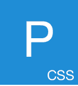

# PureCSS 教程

> 原文：<https://www.javatpoint.com/pure-css-tutorial>

PureCSS 教程提供了 Pure.CSS .我们的 Pure 的基本和高级概念。CSS 教程是为初学者和专业人士设计的。

PureCSS 是一个 CSS 框架，用来开发像 Bootstrap 这样的响应性网站。是雅虎开发的。

我们的纯洁。CSS 教程包含了 Pure 的所有主题。CSS 如什么是PureCSS，如何使用 Pure。CSS，纯。CSS 表格、网格、图标、按钮、输入、表格、带边框表格、对齐表格、堆叠表格、剥离表格、默认表格、下拉列表、图像、复选框、单选按钮、菜单、响应设计等。

* * *

## PureCSS 索引

* * *

**纯。CSS 教程**

*   [PureCSS 教程](pure-css-tutorial)
*   [什么是PureCSS](what-is-pure-css)
*   [如何使用 Pure。CSS](how-to-use-pure-css)
*   [纯。CSS 响应](pure-css-responsive-design)
*   [纯。CSS 按钮](pure-css-buttons)
*   [纯。CSS 图像](pure-css-images)
*   [纯。CSS 图标](pure-css-icons)
*   [纯。CSS 网格](pure-css-grids)
*   [纯。CSS 菜单](pure-css-menus)
*   [纯。CSS 下拉菜单](pure-css-dropdown)

**纯。CSS 输入**

*   [纯。CSS 输入](pure-css-inputs)
*   [所需输入](pure-css-required-inputs)
*   [禁用输入](pure-css-disabled-inputs)
*   [只读输入](pure-css-read-only-inputs)
*   [舍入输入](pure-css-rounded-inputs)
*   [【check boxex】&收音机](pure-css-checkboxes-and-radios)

**纯。CSS 表格**

*   [纯。CSS 表单](pure-css-form)
*   [默认表单](pure-css-default-form)
*   [堆叠形式](pure-css-stacked-form)
*   [对齐形式](pure-css-aligned-form)
*   [多栏表格](pure-css-multi-column-form)
*   [分组表格](pure-css-grouped-input-form)
*   [输入尺寸表](pure-css-input-sizing-form)

**纯。CSS 表格**

*   [纯。CSS 表格](pure-css-tables)
*   [默认表格](pure-css-default-table)
*   [带边框表格](pure-css-bordered-table)
*   [水平表](pure-css-table-with-horizontal-borders)
*   [剥离表](pure-css-stripped-table)

**面试问题**

*   [纯。CSS 面试](pure-css-interview-questions)

* * *

## 先决条件

学习纯净。CSS，你必须具备 HTML 和 CSS 的基础知识。

## 观众

我们的纯洁。CSS 教程旨在帮助初学者和专业人士。

## 问题

我们向您保证，您在这款 Pure 中不会发现任何问题。CSS 教程。但是如果有任何错误，请在联系表格中发布问题。