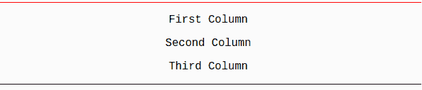

# 如何使用 Pure？半铸钢ˌ钢性铸铁(Cast Semi-Steel)

> 原文：<https://www.javatpoint.com/how-to-use-pure-css>

使用 Pure 有两种方法。CSS:

*   本地安装
*   使用基于 CDN 的版本

* * *

## 本地安装

您可以从这里下载最新版本的 pure.css 文件到您的系统中:https://purecss.io/start/，并将其包含在您的 HTML 代码中。

**例**

让我们看看如何在 HTML 文件中包含 CSS 文件。

```
<html>
   <head>
      <title>The PURE.CSS Example</title>
      <meta name="viewport" content="width=device-width, initial-scale=1">
      <link rel="stylesheet" href="pure-min.css">

      <style>
         .grids-example {
            background: rgb(250, 250, 250);
            margin: 2em auto;
            border-top: 1px solid red;
            border-bottom: 1px solid black;			
            font-family: Consolas, 'Liberation Mono', Courier, monospace;
            text-align: center;					
         }
      </style>

   </head>

  <body>
      <div class="grids-example">
         <div class="pure-g">
            <div class="pure-u-1-3"><p>First Column</p></div>
            <div class="pure-u-1-3"><p>Second Column</p></div>
            <div class="pure-u-1-3"><p>Third Column</p></div>
         </div>
      </div>
   </body>
</html> 

```

[Test it Now](https://www.javatpoint.com/oprweb/test.jsp?filename=purecsshowtousepurecss1)

输出:



* * *

## 使用基于 CDN 的版本

您可以从内容传递网络(CDN)将纯. css 文件直接添加到您的 HTML 页面中。yui.yahooapis.com 提供最新版本的内容。

**或**

您可以通过免费的取消打包 CDN 将 Pure 添加到您的页面。只需在项目样式表之前，将以下<link>元素添加到页面的中。

```
<link rel="stylesheet" 
href="https://unpkg.com/purecss@1.0.0/build/pure-min.css" integrity="sha384-nn4HPE8lTHyVtfCBi5yW9d20FjT8BJwUXyWZT9InLYax14RDjBj46LmSztkmNP9w" 
crossorigin="anonymous">

```

让我们在下面的例子中使用 yui.yahooapis.com CDN 版本的库。用第二种方法重写上面的例子。

**例**

```
<html>
   <head>
      <title>The PURE.CSS Example</title>
      <meta name = "viewport" content = "width = device-width, initial-scale = 1">
      <link rel = "stylesheet" href = "https://yui.yahooapis.com/pure/0.6.0/pure-min.css">

      <style>
         .grids-example {
            background: rgb(250, 250, 250);
            margin: 2em auto;
            border-top: 1px solid red;
            border-bottom: 1px solid black;			
            font-family: Consolas, 'Liberation Mono', Courier, monospace;
            text-align: center;					
         }
      </style>
   </head>

   <body>
      <div class = "grids-example">
         <div class = "pure-g">
            <div class = "pure-u-1-3"><p>First Column</p></div>
            <div class = "pure-u-1-3"><p>Second Column</p></div>
            <div class = "pure-u-1-3"><p>Third Column</p></div>
         </div>
      </div>
   </body>
</html>

```

[Test it Now](https://www.javatpoint.com/oprweb/test.jsp?filename=purecsshowtousepurecss2)

输出:

它将显示如下结果:


你可以看到这是同一个例子，但是使用了另一种方式。