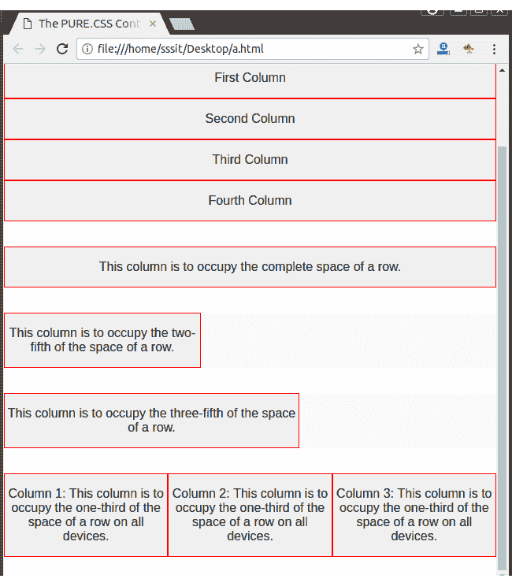

# PureCSS 响应设计

> 原文：<https://www.javatpoint.com/pure-css-responsive-design>

PureCSS 使用以下类来创建响应性设计。

| 索引 | 类别名 | 描述 |
| 1) | 。纯-u-* | 它用于设置容器在任何设备上占用所需的空间(兼容所有设备)。 |
| 2) | .纯 u-sm-* | 它用于小屏幕。它将容器设置为在具有宽度的设备上占据所需空间？568 像素。 |
| 3) | 。纯-u-md-* | 它用于中型屏幕。它将容器设置为在具有宽度的设备上占据所需空间？768 像素。 |
| 4) | 。纯-u-lg-* | 它用于大屏幕。它将容器设置为在具有宽度的设备上占据所需空间？1024px。 |
| 5) | .纯 u-xl-* | 它用于超大屏幕。它将容器设置为在具有宽度的设备上占据所需空间？1280 像素。 |

* * *

## 例子

让我们创建一个具有四列的响应网格。柱子应堆叠在小屏幕上，在中型屏幕上应占据宽度的 50%，在大型屏幕上应占据宽度的 25%。

对于小屏幕，我们添加:。纯 u-1 级

对于中型屏幕，我们添加:。纯-u-md-1-2

对于大尺寸屏幕:纯-u-lg-1-4

**见本例:**

```html
<html>
<head>
<title>The PURE.CSS Containers</title>
<meta name = "viewport" content = "width = device-width, initial-scale = 1">

<link rel="stylesheet" 
href="https://unpkg.com/purecss@1.0.0/build/pure-min.css" 
integrity="sha384-nn4HPE8lTHyVtfCBi5yW9d20FjT8BJwUXyWZT9InLYax14RDjBj46LmSztkmNP9w" 
crossorigin="anonymous">

<style>
.grids-example {
background: rgb(250, 250, 250);
margin: 2em auto;            
font-family: Consolas, 'Liberation Mono', Courier, monospace;
text-align: center;					
 }	
graybox {
background: rgb(240, 240, 240);
border: 1px solid red;			
 }	
</style>
</head>
<body>

<div class = "grids-example">       	  
<div class = "pure-g">
<div class = "pure-u-1-1">
<div class = "graybox">
<p>These four columns should stack on small screens,
should take up width: 50% on medium-sized screens, and should
take up width: 25% on large screens.</p>
</div>
</div>

<div class = "pure-u-1 pure-u-md-1-2 pure-u-lg-1-4">
<div class = "graybox">
<p>First Column</p>
</div>
</div>

<div class = "pure-u-1 pure-u-md-1-2 pure-u-lg-1-4">
<div class="graybox">
<p>Second Column</p>
</div>
</div>

<div class = "pure-u-1 pure-u-md-1-2 pure-u-lg-1-4">
<div class="graybox">
<p>Third Column</p>
</div>
</div>

<div class = "pure-u-1 pure-u-md-1-2 pure-u-lg-1-4">
<div class = "graybox">
<p>Fourth Column</p>
</div>
</div>
</div>
</div>

<div class = "grids-example">
<div class = "pure-g">
<div class = "pure-u-1">
<div class = "graybox">
<p>This column is to occupy the complete space of a row.</p>
</div>
</div>
</div>
</div>

<div class = "grids-example">
<div class = "pure-g">
<div class = "pure-u-2-5">
<div class = "graybox">
<p>This column is to occupy the two-fifth of the space of a row.</p>
</div>
</div>
</div>
</div>

<div class = "grids-example">
<div class = "pure-g">
<div class = "pure-u-3-5">
<div class = "graybox">
<p>This column is to occupy the three-fifth of the space of a row.</p>
</div>
</div>
</div>
</div>   

<div class = "grids-example">
<div class = "pure-g">
<div class = "pure-u-1-3">
<div class = "graybox">
<p>Column 1: This column is to occupy the one-third of the
space of a row on all devices.</p>
</div>
</div>

<div class = "pure-u-1-3">
<div class = "graybox">
<p>Column 2: This column is to occupy the one-third of the space
of a row on all devices.</p>
</div>
</div>

<div class = "pure-u-1-3">
<div class = "graybox">
<p>Column 3: This column is to occupy the one-third of the space of a
row on all devices.</p>
</div>
</div>
</div>
</div>	
</body>
</html>

```

[Test it Now](https://www.javatpoint.com/oprweb/test.jsp?filename=purecssresponsivedesign1)

会是这样的:

输出:

