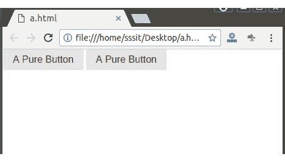
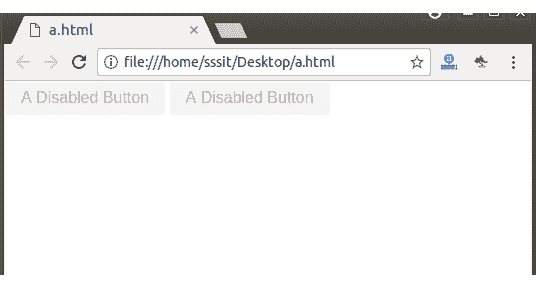
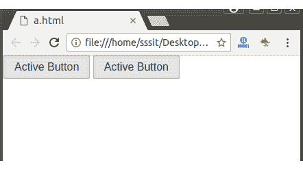
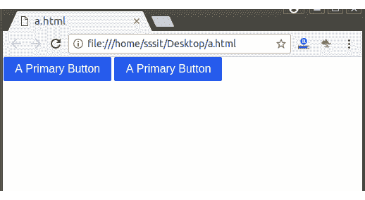
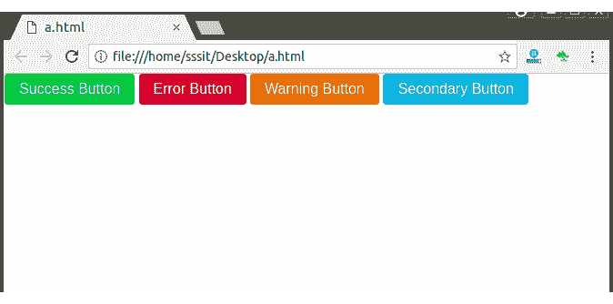
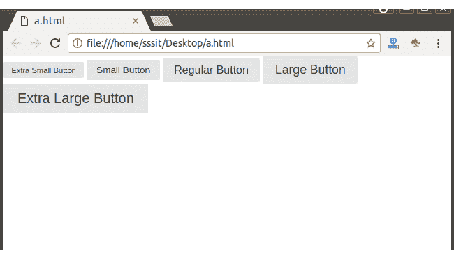
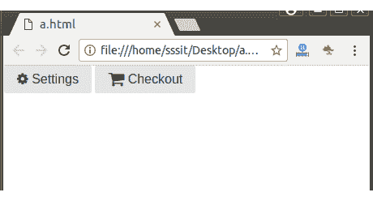

# PureCSS 按钮

> 原文：<https://www.javatpoint.com/pure-css-buttons>

## 什么是按钮

在图形用户界面(GUI)中，按钮是对话框中的一个小轮廓区域，可用于通过单击来选择选项或命令。

不同类型按钮的列表:

*   默认按钮
*   禁用的按钮
*   活动按钮
*   主按钮
*   自定义按钮
*   不同类型的按钮
*   带图标的按钮
*   按钮组

* * *

### PureCSS 默认按钮

“纯按钮”类名用于任何

**示例:**

请参见下面的示例来创建一个纯按钮。

```
<!DOCTYPE html>
<html>
<link rel="stylesheet" 
href="https://unpkg.com/purecss@1.0.0/build/pure-min.css" 
integrity="sha384-nn4HPE8lTHyVtfCBi5yW9d20FjT8BJwUXyWZT9InLYax14RDjBj46LmSztkmNP9w" 
crossorigin="anonymous">
<a class="pure-button" 
href="#">A Pure Button</a>
<button class="pure-button">
A Pure Button</button>
</html>

```

[Test it Now](https://www.javatpoint.com/oprweb/test.jsp?filename=purecssbuttons1)

输出:



* * *

### 纯粹的。禁用 CSS 按钮

“纯按钮禁用”类名与纯按钮一起用于将按钮标记为禁用。

您也可以直接在按钮上使用“禁用”属性来获得相同的结果。

**例**

请参见禁用按钮的两种方法。

```
<!DOCTYPE html>
<html>

<link rel="stylesheet" 
href="https://unpkg.com/purecss@1.0.0/build/pure-min.css" 
integrity="sha384-nn4HPE8lTHyVtfCBi5yW9d20FjT8BJwUXyWZT9InLYax14RDjBj46LmSztkmNP9w" 
crossorigin="anonymous">

<button class="pure-button pure-button-disabled">A Disabled Button</button>
<button class="pure-button" disabled>A Disabled Button</button>

</html>

```

[Test it Now](https://www.javatpoint.com/oprweb/test.jsp?filename=purecssbuttons2)

输出:



* * *

### PureCSS 活动按钮

“纯按钮激活”类名与纯按钮一起使用来设计按钮的样式，使其看起来像是“按下的”。

您可以将纯按钮活动类名放入任何

**例**

```
<!DOCTYPE html>
<html>

<link rel="stylesheet" 
href="https://unpkg.com/purecss@1.0.0/build/pure-min.css" 
integrity="sha384-nn4HPE8lTHyVtfCBi5yW9d20FjT8BJwUXyWZT9InLYax14RDjBj46LmSztkmNP9w" 
crossorigin="anonymous">

<a class="pure-button pure-button-active" href="#">Active Button</a>
<button class="pure-button pure-button-active">Active Button</button>

</html>

```

[Test it Now](https://www.javatpoint.com/oprweb/test.jsp?filename=purecssbuttons3)

输出:



* * *

### PureCSS 主要按钮

您必须在 pure-button 旁边添加“pure-button-primary”类名，以指示该按钮代表一个主要操作。

您可以将纯按钮主类名放入任何

**例**

```
<!DOCTYPE html>
<html>

<link rel="stylesheet" 
href="https://unpkg.com/purecss@1.0.0/build/pure-min.css" 
integrity="sha384-nn4HPE8lTHyVtfCBi5yW9d20FjT8BJwUXyWZT9InLYax14RDjBj46LmSztkmNP9w" 
crossorigin="anonymous">

<a class="pure-button pure-button-primary" href="#">A Primary Button</a>
<button class="pure-button pure-button-primary">A Primary Button</button>

</html>

```

[Test it Now](https://www.javatpoint.com/oprweb/test.jsp?filename=purecssbuttons4)

输出:



* * *

### 自定义按钮

您也可以为自己的应用程序裁剪按钮。自定义纯按钮非常容易，因为 pure。CSS 需要最少的样式。

将您的自定义 CSS 分组到一个类中，例如 button-foo，然后您可以将它添加到已经具有纯 button 类名的元素中。

**例**

```
<!DOCTYPE html>
<html>

<link rel="stylesheet" 
href="https://unpkg.com/purecss@1.0.0/build/pure-min.css" 
integrity="sha384-nn4HPE8lTHyVtfCBi5yW9d20FjT8BJwUXyWZT9InLYax14RDjBj46LmSztkmNP9w" 
crossorigin="anonymous">

<div>
    <style scoped>

        .button-success,
        .button-error,
        .button-warning,
        .button-secondary {
            color: white;
            border-radius: 4px;
            text-shadow: 0 1px 1px rgba(0, 0, 0, 0.2);
        }

        .button-success {
            background: rgb(28, 184, 65);
        }

        .button-error {
            background: rgb(202, 60, 60);
        }

        .button-warning {
            background: rgb(223, 117, 20);
        }

        .button-secondary {
            background: rgb(66, 184, 221);
        }

    </style>

    <button class="button-success pure-button">Success Button</button>
    <button class="button-error pure-button">Error Button</button>
    <button class="button-warning pure-button">Warning Button</button>
    <button class="button-secondary pure-button">Secondary Button</button>
</div>
</html>

```

[Test it Now](https://www.javatpoint.com/oprweb/test.jsp?filename=purecssbuttons5)

输出:



* * *

## 不同类型的按钮

*   超小按钮
*   小按钮
*   常规按钮
*   放大按钮
*   超大按钮

**例**

让我们举个例子来看看 Pure 中的所有按钮。CSS:

```
<!DOCTYPE html>
<html>

<link rel="stylesheet" 
href="https://unpkg.com/purecss@1.0.0/build/pure-min.css" 
integrity="sha384-nn4HPE8lTHyVtfCBi5yW9d20FjT8BJwUXyWZT9InLYax14RDjBj46LmSztkmNP9w" 
crossorigin="anonymous">

<div>
    <style scoped>

        .button-xsmall {
            font-size: 70%;
        }

        .button-small {
            font-size: 85%;
        }

        .button-large {
            font-size: 110%;
        }

        .button-xlarge {
            font-size: 125%;
        }

    </style>

    <button class="button-xsmall pure-button">Extra Small Button</button>
    <button class="button-small pure-button">Small Button</button>
    <button class="pure-button">Regular Button</button>
    <button class="button-large pure-button">Large Button</button>
    <button class="button-xlarge pure-button">Extra Large Button</button>
</div>
</html>

```

[Test it Now](https://www.javatpoint.com/oprweb/test.jsp?filename=purecssbuttons6)

输出:



* * *

### 带图标的按钮

Pure 没有图标字体，但是我们可以使用带有 Pure Buttons 的图标字体。在下面的例子中，我们使用的图标字体来自字体真棒。你必须把字体棒极了的 CSS 文件放在你的页面上，并在一个纯按钮元素中使用一个*元素。*

通过使用以下代码，在项目中使用 font-awesome:

```
<link rel="stylesheet" 
href="https://cdnjs.cloudflare.com/ajax/libs/font-awesome/4.4.0/css/font-awesome.min.css">

```

**例**

```
<!DOCTYPE html>
<html>
<head>
<link rel="stylesheet" 
href="https://cdnjs.cloudflare.com/ajax/libs/font-awesome/4.4.0/css/font-awesome.min.css">

<link rel="stylesheet" 
href="https://unpkg.com/purecss@1.0.0/build/pure-min.css" 
integrity="sha384-nn4HPE8lTHyVtfCBi5yW9d20FjT8BJwUXyWZT9InLYax14RDjBj46LmSztkmNP9w" 
crossorigin="anonymous">

<button class="pure-button">
    <i class="fa fa-cog"></i>
    Settings
</button>

<a class="pure-button" href="#">
    <i class="fa fa-shopping-cart fa-lg"></i>
    Checkout
</a>
</head>

</html>

```

[Test it Now](https://www.javatpoint.com/oprweb/test.jsp?filename=purecssbuttons7)

输出:

