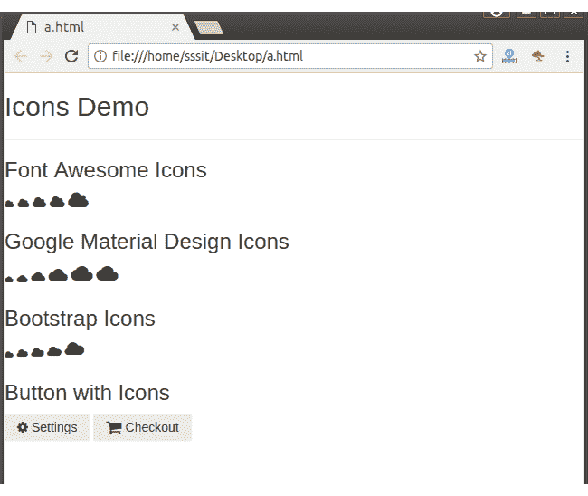

# PureCSS 图标

> 原文：<https://www.javatpoint.com/pure-css-icons>

Pure 支持的流行图标库列表。CSS:

*   字体超赞图标
*   谷歌材质图标
*   引导图标

使用纯净。CSS 图标将图标的名称放在 HTML 元素的类中。

**示例:**

```html
<!DOCTYPE html>
<html>

<link rel="stylesheet" 
href="https://unpkg.com/purecss@1.0.0/build/pure-min.css" 
integrity="sha384-nn4HPE8lTHyVtfCBi5yW9d20FjT8BJwUXyWZT9InLYax14RDjBj46LmSztkmNP9w" 
crossorigin="anonymous">

<meta name="viewport" content="width=device-width, initial-scale=1">	  
<link rel="stylesheet" href="https://yui.yahooapis.com/pure/0.6.0/pure-min.css">	  
<link rel="stylesheet" href="https://cdnjs.cloudflare.com/ajax/libs/font-awesome/4.4.0/css/font-awesome.min.css">	  
<link rel="stylesheet" href="https://fonts.googleapis.com/icon?family=Material+Icons">	  
<link rel="stylesheet" href="https://maxcdn.bootstrapcdn.com/bootstrap/3.3.7/css/bootstrap.min.css">
<script src="https://ajax.googleapis.com/ajax/libs/jquery/3.2.1/jquery.min.js"></script>
<script src="https://maxcdn.bootstrapcdn.com/bootstrap/3.3.7/js/bootstrap.min.js"></script>
<body>   
<style>  
.xsmall {
font-size: 70%;
        }
.small {
font-size: 85%;
       }
.large {
font-size: 110%;
       }
.xlarge {
font-size: 150%;
        }
</style>
</head>

<body>
<h2>Icons Demo</h2>
<hr/>
<h3>Font Awesome Icons</h3>
<i class="fa fa-cloud xsmall"></i>
<i class="fa fa-cloud small"></i>
<i class="fa fa-cloud"></i>
<i class="fa fa-cloud large"></i>
<i class="fa fa-cloud xlarge"></i>

<h3>Google Material Design Icons</h3>      
<i class="material-icons xsmall">cloud</i>	
<i class="material-icons small">cloud</i>
<i class="material-icons large">cloud</i>
<i class="material-icons xlarge">cloud</i>
<i class="material-icons">cloud</i>
<i class="material-icons">cloud</i>

<h3>Bootstrap Icons</h3>
<i class="glyphicon glyphicon-cloud xsmall"></i>
<i class="glyphicon glyphicon-cloud small"></i>
<i class="glyphicon glyphicon-cloud"></i>
<i class="glyphicon glyphicon-cloud large"></i>
<i class="glyphicon glyphicon-cloud xlarge"></i>

<h3>Button with Icons</h3>
<button class="pure-button"><i class="fa fa-cog"></i> Settings</button>
<a class="pure-button" href="#"><i class="fa fa-shopping-cart fa-lg"></i> Checkout</a>
</body>
</html>
</html>

```

[Test it Now](https://www.javatpoint.com/oprweb/test.jsp?filename=purecssicons1)

输出:

