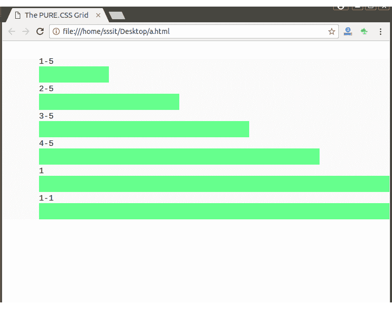
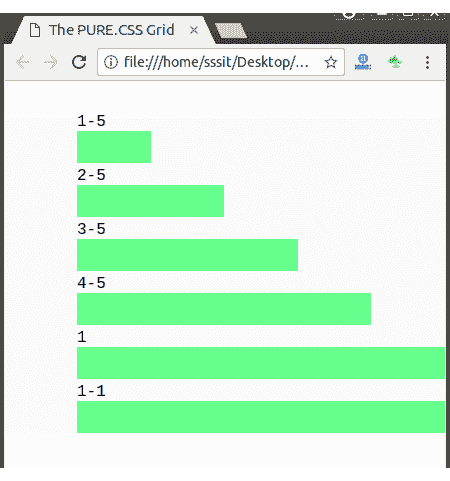
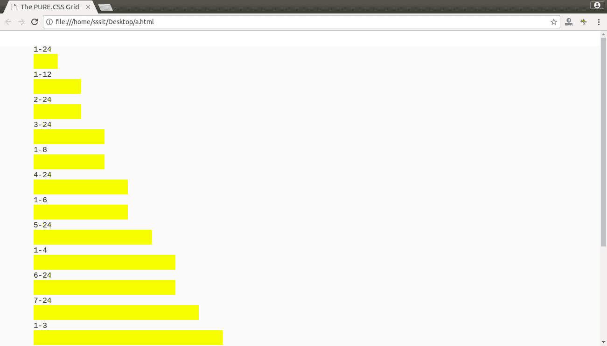
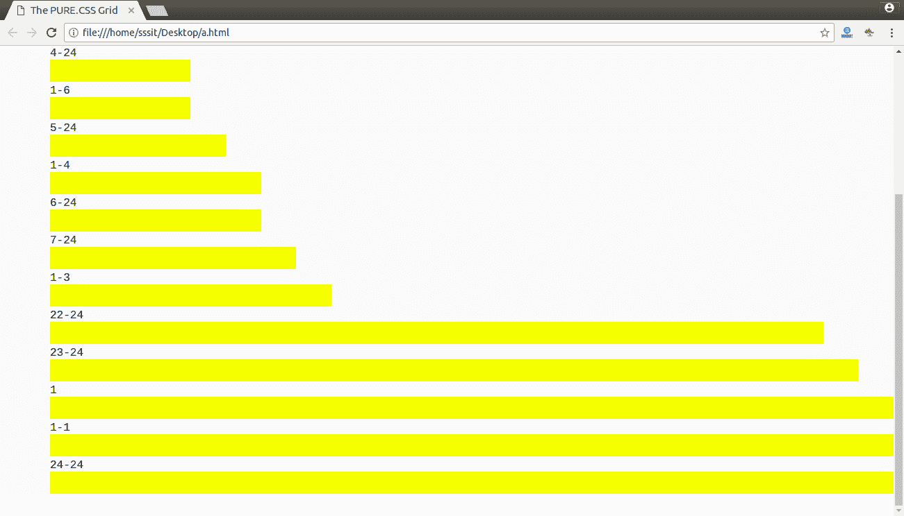

# 纯粹的。CSS 网格

> 原文:[https://www.javatpoint.com/pure-css-grids](https://www.javatpoint.com/pure-css-grids)

Pure grid 是 Pure.CSS 的一个概念，Pure Grid 中有两种类型的类。

*   **纯-g:** 一个网格类
*   **纯-u-*:** 单位类

请参见以下规则以使用纯网格:

*   单位宽度是分数。例如，pure-u-1-2 代表 1/2 或 50%宽度，pure-u-2-5 代表 2/5 或 40%宽度，以此类推。
*   纯网格(带有纯 g 类的元素)的子元素必须使用纯 u 或纯 u *类名。
*   所有内容都应该是一个网格单元的一部分，才能被正确地呈现。

* * *

## 网格单位大小

*   第 5 <sup>个</sup>单位尺寸
*   第 24 <sup>次</sup>单位尺寸

让我们举个例子来展示一些可以附加到 pure-ui 和 pure-g 的可用单元。

**例如:**如果要创建 50%宽度的单元格，可以使用 css 样式 pure-ui-1-2。

## 第五基地单位

**例**

```
<html>
<head>
<title>The PURE.CSS Grid</title>
<meta name="viewport" 
content="width=device-width, initial-scale=1">
<link rel="stylesheet" 
href="https://unpkg.com/purecss@1.0.0/build/pure-min.css" 
integrity="sha384-nn4HPE8lTHyVtfCBi5yW9d20FjT8BJwUXyWZT9InLYax14RDjBj46LmSztkmNP9w" 
crossorigin="anonymous">

      <style>
         .grids-example {
            background: rgb(250, 250, 250);
            margin: 2em auto;            
            font-family: Consolas, 'Liberation Mono', Courier, monospace;
            text-align: center;					
         }	
         .grid-unit {
            margin: 0.25em 0;
            padding-left: 4.5em;
         }
         .grid-unit .grid-unit-width {
            font-family: Consolas, 'Liberation Mono', Courier, monospace;
         }
         .grid-unit-bar {
            height: 2em;
            background: lightgreen;
         }
      </style>
   </head>

   <body>

      <div class="grids-example">       	  
         <div class="grid-unit  pure-g">
            <div class="grid-unit-width pure-u">1-5</div>
            <div class="grid-unit-details pure-u-1">
               <div class="pure-g">
                  <div class="grid-unit-bar pure-u-1-5"></div>
               </div>
            </div>
         </div>

         <div class="grid-unit  pure-g">
            <div class="grid-unit-width pure-u">2-5</div>
            <div class="grid-unit-details pure-u-1">
               <div class="pure-g">
                  <div class="grid-unit-bar pure-u-2-5"></div>
               </div>
            </div>
         </div>

         <div class="grid-unit  pure-g">
            <div class="grid-unit-width pure-u">3-5</div>
            <div class="grid-unit-details pure-u-1">
               <div class="pure-g">
                  <div class="grid-unit-bar pure-u-3-5"></div>
               </div>
            </div>
         </div>

         <div class="grid-unit pure-g">
            <div class="grid-unit-width pure-u">4-5</div>
            <div class="grid-unit-details pure-u-1">
               <div class="pure-g">
                  <div class="grid-unit-bar pure-u-4-5"></div>
               </div>
            </div>
         </div>

         <div class="grid-unit pure-g">
            <div class="grid-unit-width pure-u">1</div>
            <div class="grid-unit-details pure-u-1">
               <div class="pure-g">
                  <div class="grid-unit-bar pure-u-1"></div>
               </div>
            </div>
         </div>

         <div class="grid-unit pure-g">
            <div class="grid-unit-width pure-u">1-1</div>
            <div class="grid-unit-details pure-u-1">
               <div class="pure-g">
                  <div class="grid-unit-bar pure-u-1-1"></div>
               </div>
            </div>
         </div>
      </div>	
   </body>
</html>

```

[Test it Now](https://www.javatpoint.com/oprweb/test.jsp?filename=purecssgrids1)

输出:




它可以在任何屏幕尺寸下自我调节。

**例如:**


* * *

## 第 24 基本单位

它与基于第 5<sup>的单位相同，但是基于第 24<sup>的单位具有类名 pure-u-x-24，其中 x 可以是 1 到 24 之间的任何值。</sup></sup>

**例**

```
<html>
   <head>
      <title>The PURE.CSS Grid</title>
      <meta name = "viewport" content = "width = device-width, initial-scale = 1">
<link rel="stylesheet" 
href="https://unpkg.com/purecss@1.0.0/build/grids-responsive-min.css">

<link rel="stylesheet" 
href="https://unpkg.com/purecss@1.0.0/build/pure-min.css" 
integrity="sha384-nn4HPE8lTHyVtfCBi5yW9d20FjT8BJwUXyWZT9InLYax14RDjBj46LmSztkmNP9w" 
crossorigin="anonymous">
<style>
         .grids-example {
            background: rgb(250, 250, 250);
            margin: 2em auto;            
            font-family: Consolas, 'Liberation Mono', Courier, monospace;
            text-align: center;					
         }	
         .grid-unit {
            margin: 0.25em 0;
            padding-left: 4.5em;
         }
         .grid-unit .grid-unit-width {
            font-family: Consolas, 'Liberation Mono', Courier, monospace;
         }
         .grid-unit-bar {
            height: 2em;
            background: yellow;
         }
      </style>
   </head>
   <body>

      <div class = "grids-example">       	  
         <div class = "grid-unit  pure-g">
            <div class = "grid-unit-width pure-u">1-24</div>
            <div class = "grid-unit-details pure-u-1">
			      <div class = "pure-g">
                  <div class = "grid-unit-bar pure-u-1-24"></div>
               </div>
            </div>
         </div>

         <div class = "grid-unit  pure-g">
            <div class = "grid-unit-width pure-u">1-12</div>
            <div class = "grid-unit-details pure-u-1">
               <div class = "pure-g">
                  <div class = "grid-unit-bar pure-u-1-12"></div>
               </div>
            </div>
         </div>

         <div class = "grid-unit  pure-g">
            <div class = "grid-unit-width pure-u">2-24</div>
            <div class = "grid-unit-details pure-u-1">
               <div class = "pure-g">
                  <div class = "grid-unit-bar pure-u-2-24"></div>
               </div>
            </div>
         </div>

         <div class = "grid-unit  pure-g">
            <div class = "grid-unit-width pure-u">3-24</div>
            <div class = "grid-unit-details pure-u-1">
               <div class = "pure-g">
                  <div class = "grid-unit-bar pure-u-3-24"></div>
               </div>
            </div>
         </div>

         <div class = "grid-unit  pure-g">
            <div class = "grid-unit-width pure-u">1-8</div>
            <div class = "grid-unit-details pure-u-1">
               <div class = "pure-g">
                  <div class = "grid-unit-bar pure-u-1-8"></div>
               </div>
            </div>
         </div>

         <div class = "grid-unit  pure-g">
            <div class = "grid-unit-width pure-u">4-24</div>
            <div class = "grid-unit-details pure-u-1">
               <div class = "pure-g">
                  <div class = "grid-unit-bar pure-u-4-24"></div>
               </div>
            </div>
         </div>

         <div class = "grid-unit  pure-g">
            <div class = "grid-unit-width pure-u">1-6</div>
            <div class = "grid-unit-details pure-u-1">
               <div class = "pure-g">
                  <div class = "grid-unit-bar pure-u-1-6"></div>
               </div>
            </div>
         </div>

         <div class = "grid-unit  pure-g">
            <div class = "grid-unit-width pure-u">5-24</div>
            <div class = "grid-unit-details pure-u-1">
               <div class = "pure-g">
                  <div class = "grid-unit-bar pure-u-5-24"></div>
               </div>
            </div>
         </div>

         <div class = "grid-unit  pure-g">
            <div class = "grid-unit-width pure-u">1-4</div>
            <div class = "grid-unit-details pure-u-1">
               <div class = "pure-g">
                  <div class = "grid-unit-bar pure-u-1-4"></div>
               </div>
            </div>
         </div>

         <div class = "grid-unit  pure-g">
            <div class = "grid-unit-width pure-u">6-24</div>
            <div class = "grid-unit-details pure-u-1">
               <div class = "pure-g">
                  <div class = "grid-unit-bar pure-u-6-24"></div>
               </div>
            </div>
         </div>

         <div class = "grid-unit  pure-g">
            <div class = "grid-unit-width pure-u">7-24</div>
            <div class = "grid-unit-details pure-u-1">
               <div class = "pure-g">
                  <div class = "grid-unit-bar pure-u-7-24"></div>
               </div>
            </div>
         </div>

         <div class = "grid-unit  pure-g">
            <div class = "grid-unit-width pure-u">1-3</div>
            <div class = "grid-unit-details pure-u-1">
               <div class = "pure-g">
                  <div class = "grid-unit-bar pure-u-1-3"></div>
               </div>
            </div>
         </div>

         <div class = "grid-unit  pure-g">
            <div class = "grid-unit-width pure-u">22-24</div>
            <div class = "grid-unit-details pure-u-1">
               <div class = "pure-g">
                  <div class = "grid-unit-bar pure-u-22-24"></div>
               </div>
            </div>
         </div>

         <div class = "grid-unit  pure-g">
            <div class = "grid-unit-width pure-u">23-24</div>
            <div class = "grid-unit-details pure-u-1">
               <div class = "pure-g">
                  <div class = "grid-unit-bar pure-u-23-24"></div>
               </div>
            </div>
         </div>

         <div class = "grid-unit  pure-g">
            <div class = "grid-unit-width pure-u">1</div>
            <div class ="grid-unit-details pure-u-1">
               <div class="pure-g">
                  <div class="grid-unit-bar pure-u-1"></div>
               </div>
            </div>
         </div>

         <div class="grid-unit  pure-g">
            <div class="grid-unit-width pure-u">1-1</div>
            <div class="grid-unit-details pure-u-1">
               <div class="pure-g">
                  <div class="grid-unit-bar pure-u-1-1"></div>
               </div>
            </div>
         </div>

         <div class="grid-unit  pure-g">
            <div class="grid-unit-width pure-u">24-24</div>
            <div class="grid-unit-details pure-u-1">
               <div class="pure-g">
                  <div class="grid-unit-bar pure-u-24-24"></div>
               </div>
            </div>
         </div>
      </div>	
   </body>
</html>

```

[Test it Now](https://www.javatpoint.com/oprweb/test.jsp?filename=purecssgrids2)

输出:


