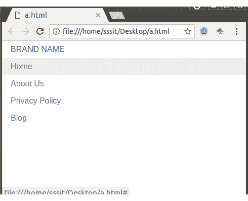
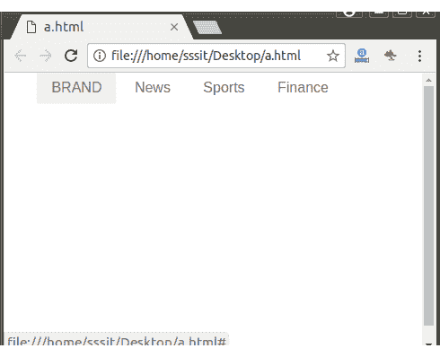
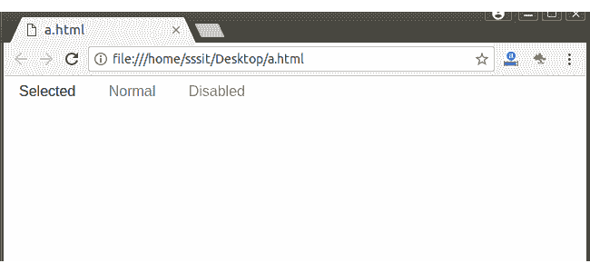

# PureCSS 菜单

> 原文：<https://www.javatpoint.com/pure-css-menus>

纯粹的。默认情况下，CSS 提供垂直菜单。在 Pure 中定制菜单非常容易。CSS 因为样式少和使用特异性低。

#### 注意:使用以下代码在您的 HTML 页面中添加 Pure。

```
<link rel="stylesheet" 
href="https://unpkg.com/purecss@1.0.0/build/pure-min.css" 
integrity="sha384-nn4HPE8lTHyVtfCBi5yW9d20FjT8BJwUXyWZT9InLYax14RDjBj46LmSztkmNP9w" 
crossorigin="anonymous">

```

* * *

## 创建垂直菜单的语法

```
<div class="pure-menu">
  <span class="pure-menu-heading">Brand Name</span>

  <ul class="pure-menu-list">
    <li class="pure-menu-item">
      <a href="#" class="pure-menu-link">Home</a>
    </li>
    <li class="pure-menu-item">
      <a href="#" class="pure-menu-link">About Us</a>
    </li>
    <li class="pure-menu-item">
      <a href="#" class="pure-menu-link">Privacy Policy</a>
    </li>
    <li class="pure-menu-item">
      <a href="#" class="pure-menu-link">Blog</a>
    </li>
  </ul>
</div>

```

* * *

## 垂直菜单(Bydefault)

**例**

```
<!DOCTYPE html>
<html>
<div class="pure-menu">
  <span class="pure-menu-heading">Brand Name</span>

  <ul class="pure-menu-list">
    <li class="pure-menu-item">
      <a href="#" class="pure-menu-link">Home</a>
    </li>
    <li class="pure-menu-item">
      <a href="#" class="pure-menu-link">About Us</a>
    </li>
    <li class="pure-menu-item">
      <a href="#" class="pure-menu-link">Privacy Policy</a>
    </li>
    <li class="pure-menu-item">
      <a href="#" class="pure-menu-link">Blog</a>
    </li>
  </ul>
</div>
</html>

```

[Test it Now](https://www.javatpoint.com/oprweb/test.jsp?filename=purecssmenus1)

输出:



* * *

## 创建水平菜单

您可以通过添加类名“纯菜单-水平”将上面的垂直菜单更改为水平菜单

使用以下链接将纯文本添加到您的 HTML 中。

```
<link rel="stylesheet" 
href="https://unpkg.com/purecss@1.0.0/build/pure-min.css" 
integrity="sha384-nn4HPE8lTHyVtfCBi5yW9d20FjT8BJwUXyWZT9InLYax14RDjBj46LmSztkmNP9w" 
crossorigin="anonymous">

```

**例**

```
<!DOCTYPE html>
<html>
  <link rel="stylesheet" 
  href="https://unpkg.com/purecss@1.0.0/build/pure-min.css" 
  integrity="sha384-nn4HPE8lTHyVtfCBi5yW9d20FjT8BJwUXyWZT9InLYax14RDjBj46LmSztkmNP9w" 
  crossorigin="anonymous">
 <div class="pure-menu pure-menu-horizontal">
    <a href="#" class="pure-menu-heading pure-menu-link"></a>
    <ul class="pure-menu-list">
        <li class="pure-menu-item"><a href="#" class="pure-menu-link">BRAND</a></li>
        <li class="pure-menu-item"><a href="#" class="pure-menu-link">News</a></li>
        <li class="pure-menu-item"><a href="#" class="pure-menu-link">Sports</a></li>
        <li class="pure-menu-item"><a href="#" class="pure-menu-link">Finance</a></li>
    </ul>
</div>
</html>

```

[Test it Now](https://www.javatpoint.com/oprweb/test.jsp?filename=purecssmenus2)

输出:



* * *

## 选定和禁用的菜单项

您可以使用类名“纯菜单-选中”将菜单项标记为选中，使用类名“纯菜单-禁用”将菜单项标记为禁用

**例**

```
<!DOCTYPE html>
<html>
<link rel="stylesheet" 
href="https://unpkg.com/purecss@1.0.0/build/pure-min.css" 
integrity="sha384-nn4HPE8lTHyVtfCBi5yW9d20FjT8BJwUXyWZT9InLYax14RDjBj46LmSztkmNP9w" 
crossorigin="anonymous">

<div class="pure-menu pure-menu-horizontal">
    <ul class="pure-menu-list">
        <li class="pure-menu-item pure-menu-selected"><a href="#" 
		class="pure-menu-link">Selected</a></li>
        <li class="pure-menu-item"><a href="#" class="pure-menu-link">Normal</a></li>
        <li class="pure-menu-item pure-menu-disabled">Disabled</li>
    </ul>
</div>
</html>

```

[Test it Now](https://www.javatpoint.com/oprweb/test.jsp?filename=purecssmenus3)

输出:

