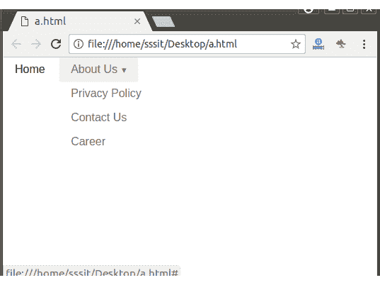

# PureCSS 下拉列表

> 原文：<https://www.javatpoint.com/pure-css-dropdown>

您可以通过对标记进行小的更改来创建下拉导航。您必须将类名**“纯菜单-有孩子”**添加到相应的菜单项中，以创建下拉菜单。要在悬停时显示子菜单，包括类名**“纯菜单-允许-悬停”**。

**示例:**

让我们举一个例子来演示如何创建下拉菜单:

```html
<!DOCTYPE html>
<html>
<link rel="stylesheet" 
href="https://unpkg.com/purecss@1.0.0/build/pure-min.css" 
integrity="sha384-nn4HPE8lTHyVtfCBi5yW9d20FjT8BJwUXyWZT9InLYax14RDjBj46LmSztkmNP9w" 
crossorigin="anonymous">

<div class="pure-menu pure-menu-horizontal">
  <ul class="pure-menu-list">
    <li class="pure-menu-item pure-menu-selected">
      <a href="#" class="pure-menu-link">Home</a>
    </li>
    <li class="pure-menu-item pure-menu-has-children pure-menu-allow-hover">
        <a href="#" class="pure-menu-link">About Us</a>
        <ul class="pure-menu-children">
          <li class="pure-menu-item">
            <a href="#" class="pure-menu-link">Privacy Policy</a>
          </li>
          <li class="pure-menu-item">
            <a href="#" class="pure-menu-link">Contact Us</a>
          </li>
          <li class="pure-menu-item">
            <a href="#" class="pure-menu-link">Career</a>
          </li>
        </ul>
    </li>
  </ul>
</div>
</html>

```

[Test it Now](https://www.javatpoint.com/oprweb/test.jsp?filename=purecssdropdown1)

输出:

