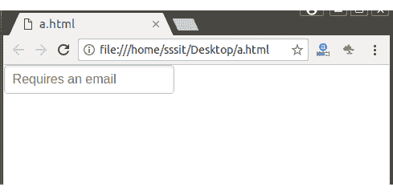

# 纯粹的。CSS 必需输入

> 原文:[https://www.javatpoint.com/pure-css-required-inputs](https://www.javatpoint.com/pure-css-required-inputs)

“必需”属性用于将表单控件标记为必需的。

**示例:**

如果您的表单需要电子邮件，那么您可以使用此属性来显示电子邮件是必需的。

```
<!DOCTYPE html>
<html>

<link rel="stylesheet" 
href="https://unpkg.com/purecss@1.0.0/build/pure-min.css" 
integrity="sha384-nn4HPE8lTHyVtfCBi5yW9d20FjT8BJwUXyWZT9InLYax14RDjBj46LmSztkmNP9w" 
crossorigin="anonymous">

<form class="pure-form">
    <input type="email" placeholder="Requires an email" required>
</form>
</html>

```

[Test it Now](https://www.javatpoint.com/oprweb/test.jsp?filename=purecssinputs1)

输出:

