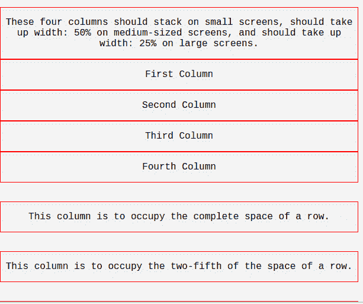

# 纯粹的。禁用 CSS 输入

> 原文：<https://www.javatpoint.com/pure-css-disabled-inputs>

“disable”属性用于禁用表单控件。当您想要在表单中添加禁用的表单控件时，可以使用它。

**示例:**

当您想要停用表单控制项时，会使用这个属性。

```
<!DOCTYPE html>
<html>

<link rel="stylesheet" 
href="https://unpkg.com/purecss@1.0.0/build/pure-min.css" 
integrity="sha384-nn4HPE8lTHyVtfCBi5yW9d20FjT8BJwUXyWZT9InLYax14RDjBj46LmSztkmNP9w" 
crossorigin="anonymous">

<form class="pure-form">
    <input type="text" placeholder="This input is disabled..." disabled>
</form>
</html>

```

[Test it Now](https://www.javatpoint.com/oprweb/test.jsp?filename=purecssinputs2)

输出:

