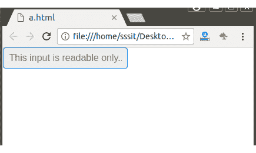

# 纯粹的。CSS 只读输入

> 原文:[https://www.javatpoint.com/pure-css-read-only-inputs](https://www.javatpoint.com/pure-css-read-only-inputs)

“readonly”属性用于使表单输入成为只读的。禁用和只读的区别在于只读输入仍然是可聚焦的，但是你不能写任何东西。这允许人们与输入交互并选择其文本，而禁用的控件则不具有交互性。

**示例:**

```
<!DOCTYPE html>
<html>

<link rel="stylesheet" 
href="https://unpkg.com/purecss@1.0.0/build/pure-min.css" 
integrity="sha384-nn4HPE8lTHyVtfCBi5yW9d20FjT8BJwUXyWZT9InLYax14RDjBj46LmSztkmNP9w" 
crossorigin="anonymous">

<form class="pure-form">
    <input type="text" value="This input is readable only.." readonly>
</form>
</html>

```

[Test it Now](https://www.javatpoint.com/oprweb/test.jsp?filename=purecssinputs3)

输出:

