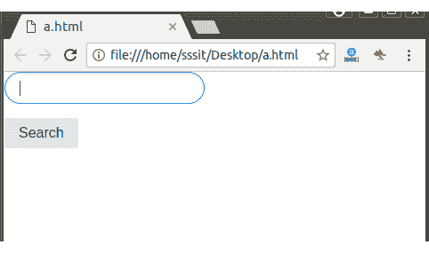

# 纯粹的。CSS 舍入输入

> 原文:[https://www.javatpoint.com/pure-css-rounded-inputs](https://www.javatpoint.com/pure-css-rounded-inputs)

“纯输入圆角”类名用于显示带有圆角的窗体控件。它通常用于搜索索引。

**示例:**

```
<!DOCTYPE html>
<html>

<link rel="stylesheet" 
href="https://unpkg.com/purecss@1.0.0/build/pure-min.css" 
integrity="sha384-nn4HPE8lTHyVtfCBi5yW9d20FjT8BJwUXyWZT9InLYax14RDjBj46LmSztkmNP9w" 
crossorigin="anonymous">

<form class="pure-form">
    <input type="text" class="pure-input-rounded">
    <button type="submit" class="pure-button">Search</button>
</form>
</html>

```

[Test it Now](https://www.javatpoint.com/oprweb/test.jsp?filename=purecssinputs4)

输出:

