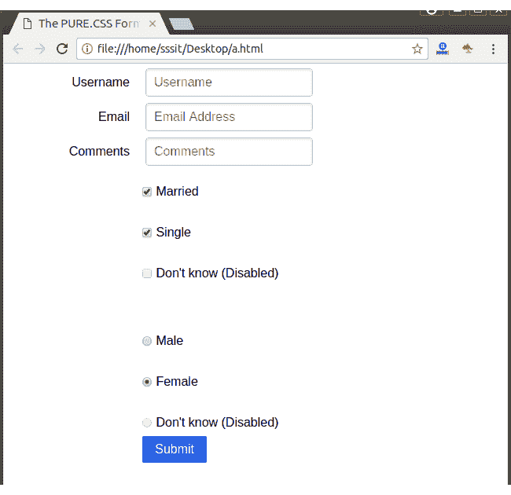

# PureCSS 表单

> 原文：<https://www.javatpoint.com/pure-css-form>

PureCSS 为表单设计提供了一个非常漂亮且反应灵敏的 CSS。您必须在

<form>元素中添加一个类名“纯表单”来创建表单。</form>

下面是一个 CSS 类的列表，可以用来创建一个带有 Pure 的表单。

| 索引 | 类别名 | 描述 |
| 1) | 纯形式 | 它用于指定紧凑的内联表单。 |
| 2) | 纯堆叠形式 | 它用于表示标签下带有输入元素的堆叠表单。它与纯形式一起使用。 |
| 3) | 纯形式对齐 | 它用于表示标签下有输入元素的对齐表单。与纯形式一起使用。 |
| 4) | 纯输入舍入 | 它用于显示带有圆角的窗体控件 |
| 5) | 纯按钮 | 它用来美化一个按钮。 |
| 6) | 纯复选框 | 它用于美化复选框。 |
| 7) | 纯无线电 | 它被用来美化收音机。 |

**例**

让我们举一个例子，通过使用上面所有的类来创建一个表单。

```
<html>
   <head>
<title>The PURE.CSS Forms</title>
<meta name = "viewport" content = "width = device-width, initial-scale = 1">
<link rel="stylesheet" 
href="https://unpkg.com/purecss@1.0.0/build/pure-min.css" 
integrity="sha384-nn4HPE8lTHyVtfCBi5yW9d20FjT8BJwUXyWZT9InLYax14RDjBj46LmSztkmNP9w" 
crossorigin="anonymous">

</head>

<body>
      <form class = "pure-form pure-form-aligned">
         <fieldset>
            <div class = "pure-control-group">      
               <label for = "name">Username</label>
               <input id = "name" type = "text" placeholder = "Username" required>
            </div>

            <div class = "pure-control-group">
               <label for = "email">Email</label>
               <input id = "email" type = "text" placeholder = "Email Address" required>       
            </div>

            <div class = "pure-control-group">   
               <label for = "comments">Comments</label>
               <input id = "comments" type="text" placeholder = "Comments">       
            </div>

            <div class = "pure-controls">
               <label  for = "married" class = "pure-checkbox">
                  <input id = "married" type = "checkbox" checked = "checked">
                  Married
               </label>
               <br>

               <label  for = "single" class = "pure-checkbox">
                  <input id = "single" type = "checkbox">
                  Single
               </label>
               <br>

               <label for = "dontknow" class = "pure-checkbox">
                  <input id = "dontknow" type = "checkbox" disabled>
                  Don't know (Disabled)
               </label>               
               <br>
               <br>
            </div>

            <div class = "pure-controls">
               <label for = "male" class = "pure-radio">
                  <input id = "male" type = "radio" name = "gender" value = "male" checked>
                  Male
               </label>
               <br>

               <label for = "female" class= "pure-radio">
                  <input id = "female" type = "radio" name = "gender" value = "female">
                  Female
               </label>
               <br>

               <label for = "dontknow1" class = "pure-radio">
                  <input id = "dontknow1" type = "radio" name = "gender" value = "female" disabled>
                  Don't know (Disabled)
               </label>
               <button type = "submit" class = "pure-button pure-button-primary">Submit</button>

            </div>
         </fieldset>
      </form>       
   </body>
</html>

```

[Test it Now](https://www.javatpoint.com/oprweb/test.jsp?filename=purecssforms1)

输出:



* * *

## 纯粹的类型。CSS 表单

以下是不同类型的纯。CSS 表单:

*   默认表单
*   堆叠形式
*   对齐形式
*   多列表单
*   分组输入
*   输入尺寸表