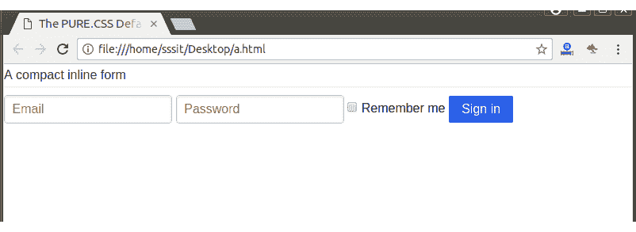

# 纯粹的。CSS 默认表单

> 原文:[https://www.javatpoint.com/pure-css-default-form](https://www.javatpoint.com/pure-css-default-form)

类名“纯表单”用于创建默认的内联表单。

**例**

让我们举一个例子来创建一个紧凑的内联表单。

```
<html>
   <head>
<title>The PURE.CSS Default Form</title>
<meta name = "viewport" content = "width = device-width, initial-scale = 1">

<link rel="stylesheet" 
href="https://unpkg.com/purecss@1.0.0/build/pure-min.css" 
integrity="sha384-nn4HPE8lTHyVtfCBi5yW9d20FjT8BJwUXyWZT9InLYax14RDjBj46LmSztkmNP9w" 
crossorigin="anonymous">
   <form class="pure-form">
    <fieldset>
        <legend>A compact inline form</legend>

        <input type="email" placeholder="Email">
        <input type="password" placeholder="Password">

        <label for="remember">
            <input id="remember" type="checkbox"> Remember me
        </label>

        <button type="submit" class="pure-button pure-button-primary">Sign in</button>
    </fieldset>
</form>
</html>

```

[Test it Now](https://www.javatpoint.com/oprweb/test.jsp?filename=purecssforms2)

输出:

