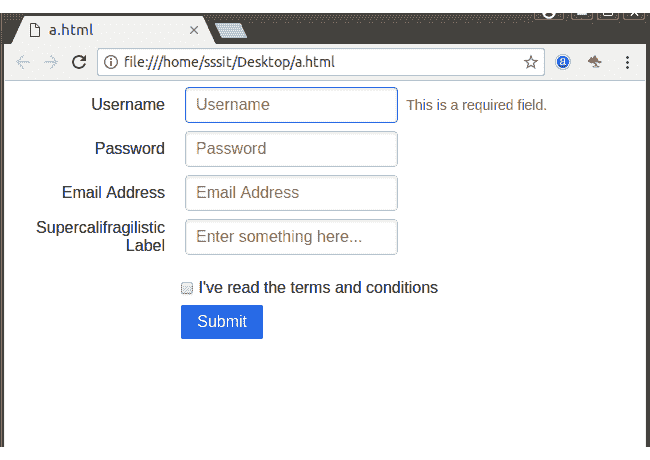

# PureCSS 对齐表单

> 原文：<https://www.javatpoint.com/pure-css-aligned-form>

类名“纯形式对齐”用于创建与纯形式旁边的

<form>元素对齐的形式。在这种类型的表单中，标签与表单输入控件右对齐，但在较小的屏幕上恢复为堆叠表单。</form>

**例**

```
<!DOCTYPE html>
<html>

<link rel="stylesheet"
href="https://unpkg.com/purecss@1.0.0/build/pure-min.css" 
integrity="sha384-nn4HPE8lTHyVtfCBi5yW9d20FjT8BJwUXyWZT9InLYax14RDjBj46LmSztkmNP9w" 
crossorigin="anonymous">

<form class="pure-form pure-form-aligned">
    <fieldset>
        <div class="pure-control-group">
            <label for="name">Username</label>
            <input id="name" type="text" placeholder="Username">
            <span class="pure-form-message-inline">This is a required field.</span>
        </div>

        <div class="pure-control-group">
            <label for="password">Password</label>
            <input id="password" type="password" placeholder="Password">
        </div>

        <div class="pure-control-group">
            <label for="email">Email Address</label>
            <input id="email" type="email" placeholder="Email Address">
        </div>

        <div class="pure-control-group">
            <label for="foo">Supercalifragilistic Label</label>
            <input id="foo" type="text" placeholder="Enter something here...">
        </div>

        <div class="pure-controls">
            <label for="cb" class="pure-checkbox">
                <input id="cb" type="checkbox"> I've read the terms and conditions
            </label>

            <button type="submit" class="pure-button pure-button-primary">Submit</button>
        </div>
    </fieldset>
</form>
</html>

```

[Test it Now](https://www.javatpoint.com/oprweb/test.jsp?filename=purecssforms4)

输出:

