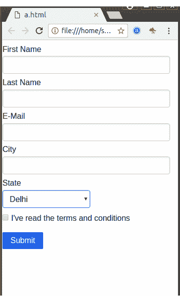
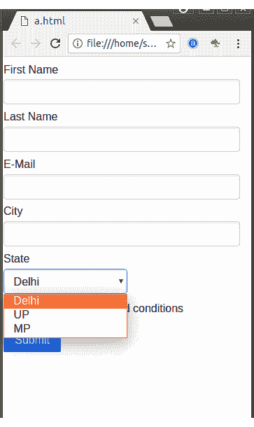

# 多列表单

> 原文：<https://www.javatpoint.com/pure-css-multi-column-form>

类名 pure-grid 用于创建一个响应性的多列表单。它要求纯响应网格出现在你的页面上。

纯响应网格是:

```
<link rel="stylesheet" 
href="https://unpkg.com/purecss@1.0.0/build/grids-responsive-min.css">

```

**例**

让我们举一个例子来创建一个响应性多列表单。

```
<!DOCTYPE html>
<html>

<link rel="stylesheet" 
href="https://unpkg.com/purecss@1.0.0/build/pure-min.css" 
integrity="sha384-nn4HPE8lTHyVtfCBi5yW9d20FjT8BJwUXyWZT9InLYax14RDjBj46LmSztkmNP9w" 
crossorigin="anonymous">

<link rel="stylesheet" 
href="https://unpkg.com/purecss@1.0.0/build/grids-responsive-min.css">

<form class="pure-form pure-form-stacked">
    <fieldset>
        <legend>Legend</legend>

        <div class="pure-g">
            <div class="pure-u-1 pure-u-md-1-3">
                <label for="first-name">First Name</label>
                <input id="first-name" class="pure-u-23-24" type="text">
            </div>

            <div class="pure-u-1 pure-u-md-1-3">
                <label for="last-name">Last Name</label>
                <input id="last-name" class="pure-u-23-24" type="text">
            </div>

            <div class="pure-u-1 pure-u-md-1-3">
                <label for="email">E-Mail</label>
                <input id="email" class="pure-u-23-24" type="email" required>
            </div>

            <div class="pure-u-1 pure-u-md-1-3">
                <label for="city">City</label>
                <input id="city" class="pure-u-23-24" type="text">
            </div>

            <div class="pure-u-1 pure-u-md-1-3">
                <label for="state">State</label>
                <select id="state" class="pure-input-1-2">
                    <option>AL</option>
                    <option>CA</option>
                    <option>IL</option>
                </select>
            </div>
        </div>

        <label for="terms" class="pure-checkbox">
            <input id="terms" type="checkbox"> I've read the terms and conditions
        </label>

        <button type="submit" class="pure-button pure-button-primary">Submit</button>
    </fieldset>
</form>
</html>

```

[Test it Now](https://www.javatpoint.com/oprweb/test.jsp?filename=purecssforms5)

输出:


