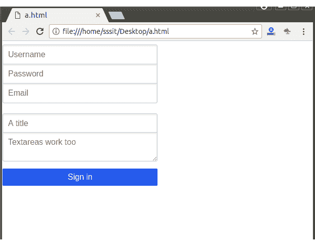

# 分组输入表单

> 原文：<https://www.javatpoint.com/pure-css-grouped-input-form>

如果你想对基于文本的输入元素进行分组，你必须用纯分组类名将它们包装在一个

<fieldset>元素中。分组输入表单最适合注册表单，在移动设备上看起来很棒。</fieldset>

**例**

让我们举一个例子来演示分组输入表单:

```html
<!DOCTYPE html>
<html>

<link rel="stylesheet" 
href="https://unpkg.com/purecss@1.0.0/build/pure-min.css" 
integrity="sha384-nn4HPE8lTHyVtfCBi5yW9d20FjT8BJwUXyWZT9InLYax14RDjBj46LmSztkmNP9w" 
crossorigin="anonymous">

<link rel="stylesheet" 
href="https://unpkg.com/purecss@1.0.0/build/grids-responsive-min.css">

<form class="pure-form">
    <fieldset class="pure-group">
        <input type="text" class="pure-input-1-2" placeholder="Username">
        <input type="text" class="pure-input-1-2" placeholder="Password">
        <input type="email" class="pure-input-1-2" placeholder="Email">
    </fieldset>

    <fieldset class="pure-group">
        <input type="text" class="pure-input-1-2" placeholder="A title">
        <textarea class="pure-input-1-2" placeholder="Textareas work too"></textarea>
    </fieldset>

    <button type="submit" class="pure-button pure-input-1-2 pure-button-primary">Sign in</button>
</form>
</html>

```

[Test it Now](https://www.javatpoint.com/oprweb/test.jsp?filename=purecssforms6)

输出:

