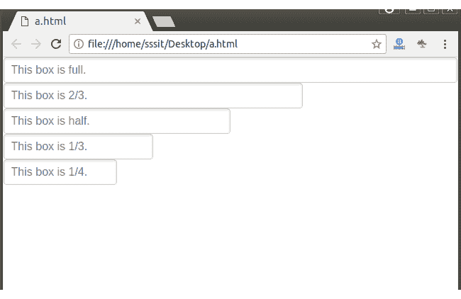

# 输入尺寸表

> 原文:[https://www.javatpoint.com/pure-css-input-sizing-form](https://www.javatpoint.com/pure-css-input-sizing-form)

您可以在表单中指定具有流体宽度大小的输入元素。它类似于纯网格。您必须为这些元素指定一个纯输入类。

**例**

```
<!DOCTYPE html>
<html>

<link rel="stylesheet" 
href="https://unpkg.com/purecss@1.0.0/build/pure-min.css" 
integrity="sha384-nn4HPE8lTHyVtfCBi5yW9d20FjT8BJwUXyWZT9InLYax14RDjBj46LmSztkmNP9w" 
crossorigin="anonymous">

<link rel="stylesheet" 
href="https://unpkg.com/purecss@1.0.0/build/grids-responsive-min.css">

<form class="pure-form">
    <input class="pure-input-1" type="text" placeholder="This box is full."><br>
    <input class="pure-input-2-3" type="text" placeholder="This box is 2/3."><br>
    <input class="pure-input-1-2" type="text" placeholder="This box is half."><br>
    <input class="pure-input-1-3" type="text" placeholder="This box is 1/3."><br>
    <input class="pure-input-1-4" type="text" placeholder="This box is 1/4."><br>
 </form>
</html>

```

[Test it Now](https://www.javatpoint.com/oprweb/test.jsp?filename=purecssforms7)

输出:

