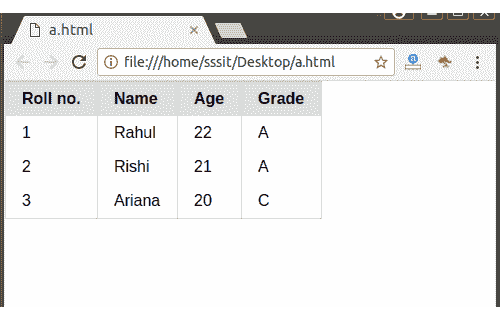

# PureCSS 默认表格

> 原文：<https://www.javatpoint.com/pure-css-default-table>

“纯表”类名用于在 Pure.CSS 中创建一个默认表

默认情况下，此类为表格元素添加填充和边框，并强调标题。

```html
<!DOCTYPE html>
<html>
<link rel="stylesheet" 
href="https://unpkg.com/purecss@1.0.0/build/pure-min.css" 
integrity="sha384-nn4HPE8lTHyVtfCBi5yW9d20FjT8BJwUXyWZT9InLYax14RDjBj46LmSztkmNP9w" 
crossorigin="anonymous">

<table class="pure-table">
    <thead>
        <tr>
            <th>Roll no.</th>
            <th>Name</th>
            <th>Age</th>
            <th>Grade</th>
        </tr>
    </thead>

    <tbody>
        <tr>
            <td>1</td>
            <td>Rahul</td>
            <td>22</td>
            <td>A</td>
        </tr>

        <tr>
            <td>2</td>
            <td>Rishi</td>
            <td>21</td>
            <td>A</td>
        </tr>

        <tr>
            <td>3</td>
            <td>Ariana</td>
            <td>20</td>
            <td>C</td>
        </tr>
    </tbody>
</table>
</html>

```

[Test it Now](https://www.javatpoint.com/oprweb/test.jsp?filename=purecsstables1)

输出:

