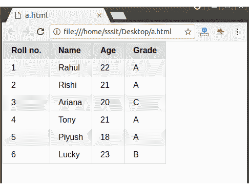

# PureCSS 剥离表

> 原文：<https://www.javatpoint.com/pure-css-stripped-table>

如果桌子很大，最好把它剥开。剥离后的桌子对用户来说更容易看到，也更有吸引力。您必须每隔一个元素添加“纯表格奇数”类名，以更改行的背景并创建斑马样式的效果。

#### 注意:在支持 CSS3 第 n 个子伪选择器的浏览器中，可以使用更简单的方法。纯表分条类名可以添加到元素中，斑马风格的分条将自动发生。这种方法在 Internet Explorer 8 或更低版本中不起作用。

**示例:**

```html
<!DOCTYPE html>
<html>
<link rel="stylesheet" 
href="https://unpkg.com/purecss@1.0.0/build/pure-min.css" 
integrity="sha384-nn4HPE8lTHyVtfCBi5yW9d20FjT8BJwUXyWZT9InLYax14RDjBj46LmSztkmNP9w" 
crossorigin="anonymous">

<table class="pure-table">
    <thead>
        <tr>
            <th>Roll no.</th>
            <th>Name</th>
            <th>Age</th>
            <th>Grade</th>
        </tr>
    </thead>

    <tbody>
       <tr class="pure-table-odd">
            <td>1</td>
            <td>Rahul</td>
            <td>22</td>
            <td>A</td>
        </tr>

        <tr>
            <td>2</td>
            <td>Rishi</td>
            <td>21</td>
            <td>A</td>
        </tr>

        <tr class="pure-table-odd">
            <td>3</td>
            <td>Ariana</td>
            <td>20</td>
            <td>C</td>
        </tr>

        <tr>
            <td>4</td>
            <td>Tony</td>
            <td>21</td>
            <td>A</td>
        </tr>

        <tr class="pure-table-odd">
            <td>5</td>
            <td>Piyush</td>
            <td>18</td>
            <td>A</td>
        </tr>

       <tr>
            <td>6</td>
            <td>Lucky</td>
            <td>23</td>
            <td>B</td>
        </tr>
    </tbody>
</table>
</html>

```

[Test it Now](https://www.javatpoint.com/oprweb/test.jsp?filename=purecsstables4)

输出:

