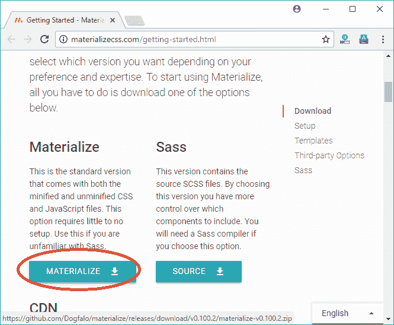
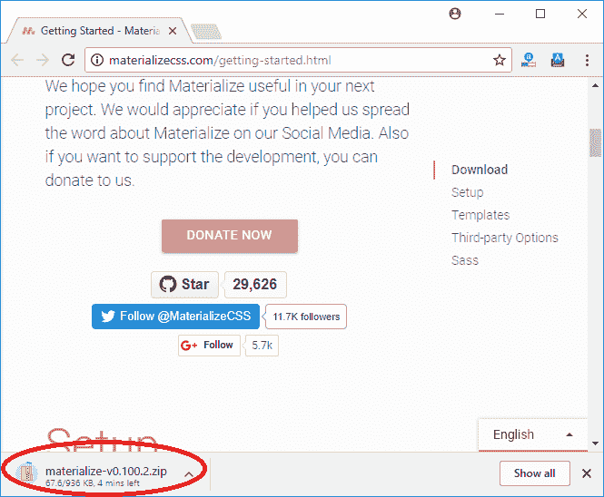

# 实现 CSS 安装

> 原文:[https://www.javatpoint.com/materialize-css-installation](https://www.javatpoint.com/materialize-css-installation)

有两种方法可以安装和使用物化 CSS。

**本地安装:**可以通过在本地系统下载物化. min.css 和物化. min.js 文件，并将其包含在 HTML 代码中，从而使用物化 CSS。

**基于 CDN 的版本:**您可以通过直接从内容交付网络(CDN)将物化. min.css 和物化. min.js 文件包含到您的 HTML 代码中来使用物化 CSS。

* * *

## 如何使用本地安装

**第一步:**前往[http://materializecss.com/getting-started.html](http://materializecss.com/getting-started.html)下载最新版本。




**第二步:**把下载的物化. min.js 文件放到你网站的一个目录下，例如/js 和物化. min.css in /css。

**示例:**

```

<!DOCTYPE html>
<html>
   <head>
      <title>The Materialize Example</title>
      <meta name = "viewport" content = "width = device-width, initial-scale = 1">      
      <link rel = "stylesheet"
         href = "https://fonts.googleapis.com/icon?family=Material+Icons">
      <link rel = "stylesheet" href = "/materialize/materialize.min.css">
      <script type = "text/javascript"
         src = "https://code.jquery.com/jquery-2.1.1.min.js"></script>           
      <script src = "/materialize/materialize.min.js"></script>             
   </head>

   <body>
      <div class = "card-panel teal lighten-2"><h3>Hello JavaTpoint!</h3></div>
   </body>
</html>

```

[Test it Now](https://www.javatpoint.com/oprweb/test.jsp?filename=materializecssinstallation1)

* * *

## 如何使用基于 CDN 的版本

直接从内容交付网络(CDN)将物化. min.js 和物化. min.css 文件包含到您的 HTML 代码中。cdnjs.cloudflare.com 提供最新版本的内容。

**例**

让我们使用来自 cdnjs.cloudflare.com CDN 的物化. min.css 和物化. min.js 重写上面的例子。

```

<!DOCTYPE html>
<html>
   <head>
      <title>The Materialize Example</title>
      <meta name = "viewport" content = "width = device-width, initial-scale = 1">      
      <link rel = "stylesheet"
         href = "https://fonts.googleapis.com/icon?family=Material+Icons">
      <link rel = "stylesheet"
         href = "https://cdnjs.cloudflare.com/ajax/libs/materialize/0.97.3/css/materialize.min.css">
      <script type = "text/javascript" src = "https://code.jquery.com/jquery-2.1.1.min.js">
      </script>           
      <script src = "https://cdnjs.cloudflare.com/ajax/libs/materialize/0.97.3/js/materialize.min.js">
      </script>             
   </head>

   <body>
      <div class = "card-panel teal lighten-2"><h3>Hello JavaTpoint!</h3></div>
   </body>
</html>

```

[Test it Now](https://www.javatpoint.com/oprweb/test.jsp?filename=materializecssinstallation2)

它会显示同样的结果。