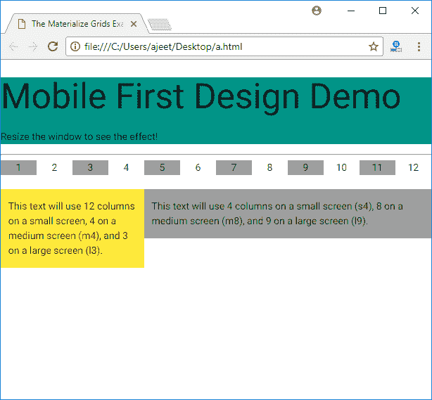

# Materialize CSS 网格

> 原文：<https://www.javatpoint.com/materialize-css-grids>

Materialize 提供了一个标准的 12 列流体响应网格系统。它使用行和列样式类分别定义行和列。

| 索引 | 类别名 | 描述 |
| 1) | 排 | 它用于指定用于响应列的无填充容器。对于完全响应的响应类，此类是必需的。 |
| 2) | 山口 | 它用于指定带有子类的列。 |

#### 注意:col 包含不同类型屏幕的几个子类。

* * *

## 小屏幕设备的列

以下是小屏幕设备(通常是智能手机)的列级样式列表。

| 索引 | 类别名 | 描述 |
| 1) | s1 | 它用于定义宽度为 08.33%的 12 列中的 1 列。 |
| 2) | s2 | 它用于定义 12 列中的 2 列，宽度为 16.66%。 |
| 3) | s3 | 它用于定义 12 列中的 3 列，宽度为 25.00%。 |
| 4) | 第四心音 | 用于定义 12 列中的第 4 列，宽度为 33.33%。它包含 s4、s5、s6、s7、s8、s9、s10、s11 |
| 12) | s12 | 它用于定义 12 列中的第 12 列，宽度为 100%。小屏幕手机的默认类别。 |

* * *

## 中型屏幕设备的列

请参见中屏设备(如平板电脑)的列级样式列表:

| 索引 | 类别名 | 描述 |
| 1) | 货币供应量 | 它用于定义 12 列中的 1 列，宽度为 08.33% |
| 2) | 货币供应量之二 | 它用于定义 12 列中的 2 列，宽度为 16.66%。 |
| 3) | m3 | 它用于定义 12 列中的 3 列，宽度为 25.00%。 |
| 4) | m4 | 它用于定义 12 列中的 4 列，宽度为 33.33%.m5 - m11 |
| 12) | m12 | 它用于定义 12 列中的 12 列，宽度为 100%。中屏手机的默认类别。 |

* * *

## 大尺寸屏幕设备的色谱柱

请参见大屏幕设备(如笔记本电脑、台式机等)的列级样式列表。

| 索引 | 类别名 | 描述 |
| 1) | 腰神经 2 | 它用于定义宽度为 08.33%的 12 列中的 1 列。 |
| 2) | l2 | 它用于定义 12 列中的 2 列，宽度为 16.66%。 |
| 3) | l3 | 它用于定义 12 列中的 3 列，宽度为 25.00%。 |
| 4) | 哌泊噻嗪棕榈酸酯 | 它用于定义 12 列中的 4 列，宽度为 33.33%。l5 - l11 |
| 12) | l12 | 它用于定义 12 列中的 12 列，宽度为 100%。大屏幕设备的默认类别。 |

* * *

## 使用

每个子类根据设备的类型确定要使用的网格列数。考虑下面的 HTML 片段。

```html

<div class = "row">
   <div class = "col s2 m4 l3">
      <p>This text will use 2 columns on a small screen, 4 on a medium screen, and 3 on
      a large screen.</p>
   </div>
</div>

```

**例**

```html

<!DOCTYPE html>
<html>
   <head>
      <title>The Materialize Grids Example</title>
      <meta name = "viewport" content = "width = device-width, initial-scale = 1">      
      <link rel = "stylesheet"
         href = "https://fonts.googleapis.com/icon?family=Material+Icons">
      <link rel = "stylesheet"
         href = "https://cdnjs.cloudflare.com/ajax/libs/materialize/0.97.3/css/materialize.min.css">
      <script type = "text/javascript"
         src = "https://code.jquery.com/jquery-2.1.1.min.js"></script>           
      <script src = "https://cdnjs.cloudflare.com/ajax/libs/materialize/0.97.3/js/materialize.min.js">
      </script>             
   </head>

   <body>
      <div class = "teal">
         <h2>Mobile First Design Demo</h2>
         <p>Resize the window to see the effect!</p>
      </div>

      <hr/> 
      <div class = "row">
         <div class = "col m1 grey center">1</div>
         <div class = "col m1 center">2</div>
         <div class = "col m1 grey center">3</div>
         <div class = "col m1 center">4</div>
         <div class = "col m1 grey center">5</div>
         <div class = "col m1 center">6</div>
         <div class = "col m1 center grey">7</div>
         <div class = "col m1 center">8</div>
         <div class = "col m1 center grey">9</div>
         <div class = "col m1 center">10</div>
         <div class = "col m1 center grey">11</div>
         <div class = "col m1 center">12</div>
      </div>

      <div class = "row">
         <div class = "col m4 l3 yellow">
            <p>This text will use 12 columns on a small screen, 4 on a medium screen (m4),
               and 3 on a large screen (l3).</p>
         </div>

         <div class = "col s4 m8 l9 grey">  
            <p>This text will use 4 columns on a small screen (s4), 8 on a medium screen
               (m8), and 9 on a large screen (l9).</p>
         </div>
      </div>
   </body>
</html>

```

[Test it Now](https://www.javatpoint.com/oprweb/test.jsp?filename=materializecssgrids1)

输出:

