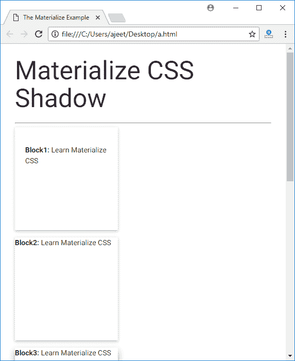

# Materialize CSS 阴影

> 原文：<https://www.javatpoint.com/materialize-css-shadows>

Materialize CSS 提供了不同类型的特殊类来将容器显示为带有阴影的纸质卡片。这些阴影使文本和图像更具吸引力。

| 索引 | 类别名 | 描述 |
| 1) | z 深度-0 | 默认情况下，它用于移除具有 z 深度的元素的阴影。 |
| 2) | z 深度-1 | 它用于为任何带有 1px 边框阴影的 html 内容设计容器样式。添加 1 的 z 深度。 |
| 3) | z 深度-2 | 它用于为任何带有 2px 边框阴影的 html 内容设置容器样式。添加 z 深度 2。 |
| 4) | z 深度-3 | 它用于为任何带有 3px 边框阴影的 html 内容设计容器样式。添加深度为 3 的 z。 |
| 5) | z 深度-4 | 它用于为任何带有 4px 边框阴影的 html 内容设计容器样式。添加 z 深度为 4。 |
| 6) | z 深度-5 | 它用于为任何带有 5px 边框阴影的 html 内容设置容器样式。添加 z 深度 5。 |

**例**

让我们举个例子来演示Materialize CSS 阴影。

```

<!DOCTYPE html>
<html>
   <head>
      <title>The Materialize Example</title>
      <meta name = "viewport" content = "width = device-width, initial-scale = 1">      
      <link rel = "stylesheet"
         href = "https://fonts.googleapis.com/icon?family=Material+Icons">
      <link rel = "stylesheet"
         href = "https://cdnjs.cloudflare.com/ajax/libs/materialize/0.97.3/css/materialize.min.css">
      <script type = "text/javascript"
         src = "https://code.jquery.com/jquery-2.1.1.min.js"></script>           
      <script src = "https://cdnjs.cloudflare.com/ajax/libs/materialize/0.97.3/js/materialize.min.js">
      </script>             

      <style>
         div {
            width : 200px;	
            height : 200px;				
         } 
      </style>
   </head>

   <body class = "container"> 
      <h2>Materialize CSS Shadow</h2>

      <hr/>
      <div class = "card-panel">
         <p><b>Block1:</b> Learn Materialize CSS</p>
      </div>

      <div class = "z-depth-1">
         <p><b>Block2:</b> Learn Materialize CSS</p>
      </div>

      <div class = "z-depth-2">
         <p><b>Block3:</b> Learn Materialize CSS</p>
      </div>

      <div class = "z-depth-3">
         <p><b>Block3:</b> Learn Materialize CSS</p>
      </div>

      <div class = "z-depth-4">
         <p><b>Block4:</b> Learn Materialize CSS5</p>
      </div>

      <div class = "z-depth-5">
         <p><b>Block4:</b> Learn Materialize CSS</p>
      </div>	  
   </body>
</html>

```

[Test it Now](https://www.javatpoint.com/oprweb/test.jsp?filename=materializecssshadows1)

输出:

