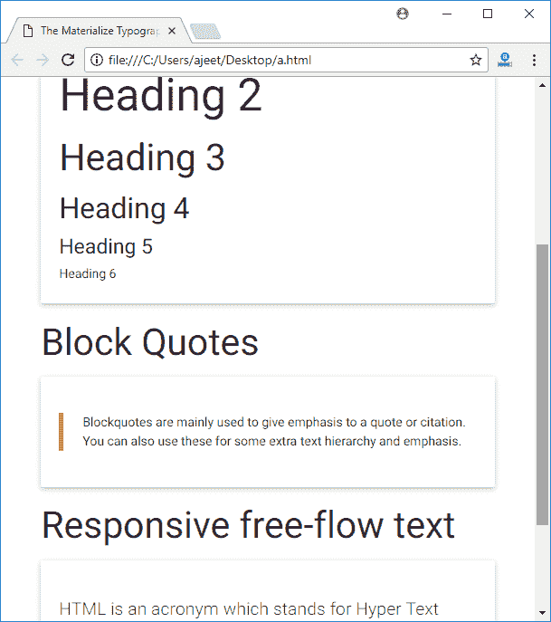

# Materialize CSS 排版

> 原文：<https://www.javatpoint.com/materialize-css-typography>

Materialize CSS 使用 Roboto 2.0 作为标准字体。可以使用以下 CSS 样式覆盖它。

```html
html {
   font-family: GillSans, Calibri, Trebuchet, sans-serif;
}

```

**例**

让我们举一个例子来演示标题、块引号和自由流动但有响应的文本。

```html
<!DOCTYPE html>
<html>
   <head>
      <title>The Materialize Typography Example</title>
      <meta name = "viewport" content = "width = device-width, initial-scale = 1">      
      <link rel = "stylesheet"
         href = "https://fonts.googleapis.com/icon?family=Material+Icons">
      <link rel = "stylesheet"
         href = "https://cdnjs.cloudflare.com/ajax/libs/materialize/0.97.3/css/materialize.min.css">
      <script type = "text/javascript"
         src = "https://code.jquery.com/jquery-2.1.1.min.js"></script>           
      <script src = "https://cdnjs.cloudflare.com/ajax/libs/materialize/0.97.3/js/materialize.min.js">
      </script> 
   </head>

   <body class = "container"> 
      <h2>Typography Example</h2>
      <hr/>

      <h3>Headings</h3>
      <div class = "card-panel">
         <h1>Heading 1</h1>
         <h2>Heading 2</h2>
         <h3>Heading 3</h3>
         <h4>Heading 4</h4>
         <h5>Heading 5</h5>
         <h6>Heading 6</h6>
      </div>

      <h3>Block Quotes</h3>
      <div class = "card-panel">
         <blockquote>
            Blockquotes are mainly used to give emphasis to a quote or citation. 
            You can also use these for some extra text hierarchy and emphasis.
         </blockquote>
      </div>

      <h3>Responsive free-flow text</h3>
      <div class = "card-panel">
         <p class = "flow-text">
            HTML is an acronym which stands for Hyper Text Markup Language.
            A markup language is a programming language that is used make text more interactive and dynamic. 
            It can turn a text into images, tables, links etc.
         </p>
      </div>		  
   </body>
</html>

```

[Test it Now](https://www.javatpoint.com/oprweb/test.jsp?filename=materializecsstypography1)

输出:

